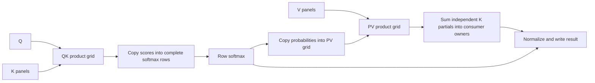

# Independent attention product layouts

Materialized attention can choose QK, softmax and PV ownership independently.
The original shared-row plan remains available. Streaming attention retains its
existing bounded-block implementation.



When PV does not split K, a copy replaces the sum. Copies and sums are ordinary
mid operations; they use existing low expansion, kernels and exchange scheduling.
GEMM output dimensions retain their valid arithmetic bounds for profiling even
when coefficient storage or softmax rows require additional physical padding.

`ProductGrid` specifies row, column and K partition counts per attention head.
Candidate generation considers bounded row counts and K partition counts, choosing
column counts within the tile budget. Complete mid implementations price input
redistribution, both GEMMs, softmax, output redistribution, partial reductions and
memory. Automatic planning also retains a complete shared-row baseline through
shortlisting, rather than requiring its locally ranked attention candidate to
survive a bounded beam.

Diagnostic controls on `ipu-trivial-test`:

```
--workload siglip-attention-benchmark --attention-batch 1
--attention-strategy materialized
--attention-products auto|shared-rows|qk-only|pv-only|independent
```

The QK-only and PV-only modes isolate each change. Independent requires both new
grids; automatic can choose either, both, or neither. These controls affect plan
selection, not runtime patching. No distributed softmax or asynchronous phase
execution is introduced.

Regression coverage checks native, QK-only, PV-only and combined implementations
on uneven dimensions, including generated kernel storage contracts, whole-word
exchange spans, and total logical GEMM FLOPs.
