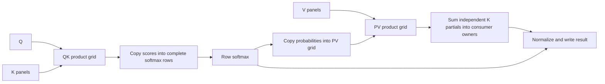

# Independent attention product layouts

Materialized attention can choose QK, softmax and PV ownership independently.
The original shared-row plan remains available. Streaming attention retains its
existing bounded-block implementation.



When PV does not split K, a copy replaces the sum. Copies and sums are ordinary
mid operations; they use existing low expansion, kernels and exchange scheduling.
GEMM output dimensions retain their valid arithmetic bounds for profiling even
when coefficient storage or softmax rows require additional physical padding.

`ProductGrid` specifies row, column and K partition counts per attention head.
Candidate generation considers bounded row counts and K partition counts, choosing
column counts within the tile budget. Complete mid implementations price input
redistribution, both GEMMs, softmax, output redistribution, partial reductions and
memory. Automatic planning also retains a complete shared-row baseline through
shortlisting, rather than requiring its locally ranked attention candidate to
survive a bounded beam.

Diagnostic controls on `ipu-trivial-test`:

```
--workload siglip-attention-benchmark --attention-batch 1
--attention-strategy materialized
--attention-products auto|shared-rows|qk-only|pv-only|independent
```

The QK-only and PV-only modes isolate each change. Independent requires both new
grids; automatic can choose either, both, or neither. These controls affect plan
selection, not runtime patching. No distributed softmax or asynchronous phase
execution is introduced.

Regression coverage checks native, QK-only, PV-only and combined implementations
on uneven dimensions, including generated kernel storage contracts, whole-word
exchange spans, and total logical GEMM FLOPs.

## SigLIP batch-1 hardware results (2026-09-07)

All results use 16 heads, 729 tokens, 72 elements per head, FP16 products and
FP32 accumulation. Timings use the profile renderer's initial-entry crop and
include Q/K/V projection, preparation, exchanges, softmax and final merge.

| Product ownership | Total cycles | Reduction from shared rows |
| --- | ---: | ---: |
| Original shared rows | 320,256 | — |
| Independent QK only | 276,624 | 13.6% |
| Independent PV only | 276,990 | 13.5% |
| Independent QK and PV | 234,378 | 26.8% |

The selected QK grid has eight query-row partitions and eleven key-column
partitions per head (1,408 compute tiles). Each tile computes 91/92 rows by
64/80 columns with K80. Maximum kernel duration fell from 54,744 to 13,572 cycles;
cycle-weighted MFU is about 60%, versus 12% with shared rows.

PV selects eight query-row partitions, one output-column partition and eight K
partitions per head (1,024 compute tiles). Each tile computes 91/92 rows by
80 columns with K96. Explicit mid partials are summed into the merge's owners.
Maximum kernel duration fell from 53,712 to 16,194 cycles, and MFU rose from
12% to 58%. Keeping all value columns together avoids replicating the large
probability matrix across column partitions. Redistribution and reductions are
included in the total-cycle comparison.

Every completed benchmark passed all 839,808 constant-input output checks, with
maximum error 0.000930. A separate Gaussian-input diagnostic sampled 256 elements
at each of five checkpoints; the final attention maximum error was 0.000040.
These were distinct benchmark programs, each timed once, plus the diagnostic
correctness run. Initial CPU-only builds exposed coefficient-shard padding and
half-word score-copy errors; those were fixed before any device execution.

Automatic product selection with the materialized strategy produced the exact
same package bytes as the forced combined variant, SHA-256
`0e261d4745147827c90f30c4316d175e9814f017eabd3637a7624941381d8130`.

Artifacts and rendered profiles are under
`artifacts/attention-product-grids/{qk-only,pv-only,independent}/`.
The Gaussian diagnostic is under `diagnostic/`; `automatic/` contains the
compile-only automatic-product comparison. The baseline is
`artifacts/useful-work/materialized/`. All 132 codegen tests and the doctest pass
(one pre-existing ignored test); Clippy passes for codegen and the hardware test
harness.

The final fully automatic check (`--attention-strategy auto --attention-products
auto`) also produced the same package hash. It includes the shared-row baseline
with both native and packed projection-store choices; those combinations are
retained through one common fallback-planning loop. `automatic-final/` contains
that compile-only verification, so the identical hardware program was not timed
again.
