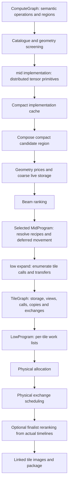
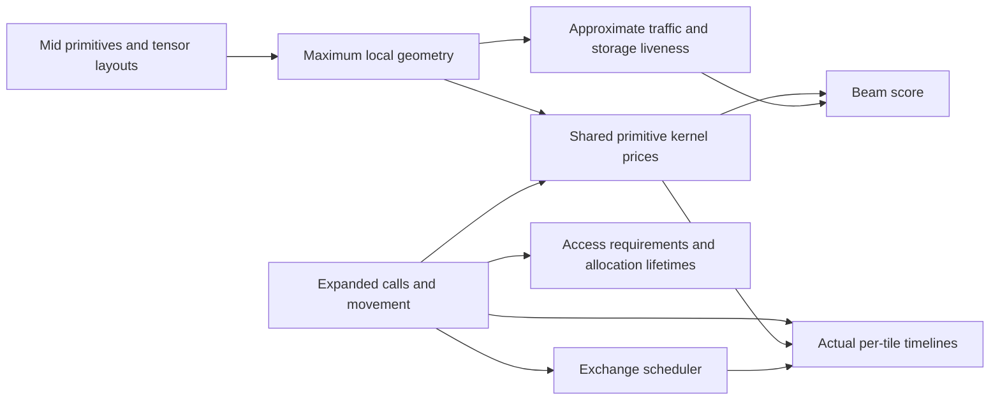
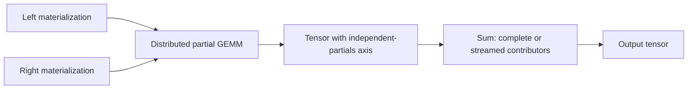

# Compiler data flow

Updated 2026-09-05 for the whole-device mid boundary. These curated diagrams
supersede the older generated `ipu-stack-package-callgraph*` artifacts.

## Selection and execution

Mid selection chooses distributed work. Low expansion realizes that work; it does
not rebuild a GEMM or attention algorithm. Cached fragments contain distributed
tensor values, not tile buffers. Final resolution inserts ordinary mid copies
where selected ownership differs, and maps claimed views directly into consumer
windows. Low projection only builds per-tile references to the expanded arenas.

## Shared prices, different precision

Beam costing never constructs tile graphs or runs physical allocation analysis.
Its exchange approximation assumes a representative fragment size rather than
walking byte spans or predicting the ready queue. Shared kernel prices avoid
maintaining separate GEMM/attention cost algorithms. Actual timelines and
scheduled phase prices remain available after expansion. Coarse memory feasibility
does not guarantee placement, particularly with disjoint ownership groups and
fragmented exchange tables.

Sources: [mid decomposition](../crates/ipu-codegen/src/mid/implementation/mod.rs),
[mid primitives](../crates/ipu-codegen/src/mid/primitive.rs),
[compact costing](../crates/ipu-codegen/src/estimate/mid.rs),
[shared kernel prices](../crates/ipu-codegen/src/estimate/primitive.rs),
[tile expansion](../crates/ipu-codegen/src/low/expand/primitive.rs),
[final timelines](../crates/ipu-codegen/src/estimate/program.rs).

## Explicit decomposition

Output-stationary GEMM instead exposes staged K panels and accumulating output
versions. Attention exposes Q/K/V copies, products, softmax and merge. Key/value packing
on a small owner grid and broadcast to the compute grid are separate mid copies. Selected
view slices are mapped copies whose output is an ordinary mid value. Tile
expansion shares physical copy realization across all these uses, including
padding, direct resident views and destination packing.

**General copy/view chain composition (#4) remains deferred at the user's
request.** Discuss its overlap with planning before implementing it. Resolving
already selected deferred views is part of the current boundary rewrite; it is
not an arbitrary producer/consumer layout optimization pass.
