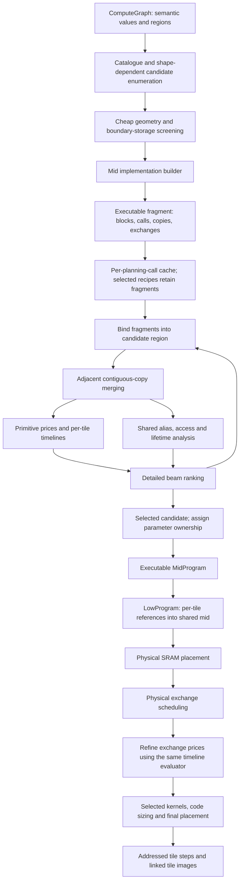
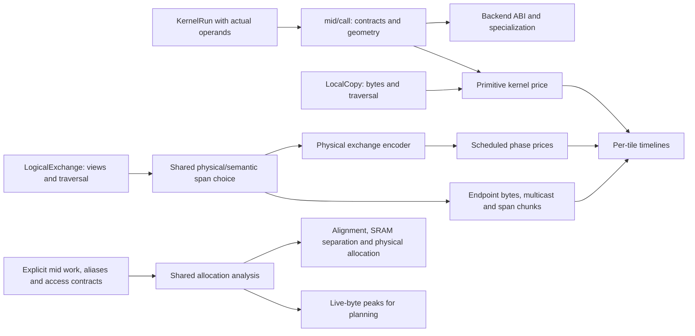
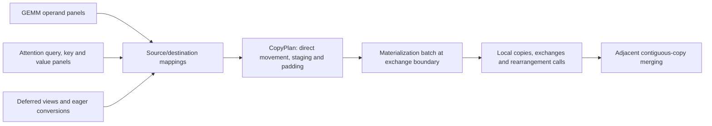

# Compiler data flow

Updated 2026-09-05 after the primitive-contract, materialization and costing
refactors. These are curated data-flow diagrams. The older generated
`ipu-stack-package-callgraph*` artifacts reference removed modules and types.

## Planning and execution

The cache retains standalone executable implementations keyed by the full
operator plan and boundary tensor types. Selected operation recipes own an
`Arc` to their fragment. Binding checks actual boundary ownership, extents and
formats, remaps arena identities, and retains original work ordering. Deferred
inputs and incompatible ownership/capacity require reconstruction by the same
builder. There is no second expansion path in low.

Detailed branch analysis composes a concrete region, including consumer-created
movement for deferred views. It retains only cycle/memory metrics after scoring;
selected operator fragments remain shared. This avoids retaining a whole program
for every beam branch. Pending views keep their source live; unclaimed offers
are restored before final ranking. Final block construction applies parameter
ownership and prices the resulting program again.

Sources: [planner](../crates/ipu-codegen/src/mid/planner.rs),
[implementation cache](../crates/ipu-codegen/src/estimate/implementation.rs),
[fragment binding](../crates/ipu-codegen/src/mid/implementation/reuse.rs),
[timelines](../crates/ipu-codegen/src/estimate/program.rs),
[allocation analysis](../crates/ipu-codegen/src/place.rs), and
[finalist selection](../crates/ipu-codegen/src/package.rs).

## Costs and storage

The old GEMM call-count, panel-traffic, attention-scratch and deferred-view cost
reconstructions have been deleted. A GEMM block inside attention uses the same
primitive price as any other GEMM. Timelines preserve tile-local order and
synchronize at exchanges. Repeat composition does not unroll bodies or invent
barriers at operator boundaries. Scheduled exchange prices use execution
multiplicity; static exchange row storage does not.

These are still estimates: primitive bandwidth/launch prices need calibration,
logical endpoint traffic is cheaper and less precise than physical scheduling,
and live-byte feasibility does not prove physical placement. Early enumeration
uses coarse boundary storage and existing grid proxies, not a second staging or
reduction implementation. Widening the beam can change which candidates survive
that heuristic. Conversion prices also remain useful before a concrete branch
exists; they do not determine the detailed region score.

## Movement and contracts

The strategy builders choose panel sizes, ownership and reuse. Shared
materialization owns destination staging, zero padding, local/remote population
and final transforms. Primitive calls derive access contracts from the actual
buffers and kernel kind. Executable contracts do not carry candidate aliasing,
materialization or local-staging policy; inherited contract repair is gone.

## Deferred work

Items #1–#3 from the requested refactor are the implemented flows above.
**#4, general copy/view chain composition, remains deferred at the user's
request.** Discuss its interaction with planning before implementing it. The
current pass only merges adjacent contiguous copies; it does not compose
`A -> temporary -> B` or redirect arbitrary producers into a consumer layout.
Padding, aliasing, write order and precision conversions constrain those changes.

Allocation labels also deserve a later review: `ExchangeStaging` still affects
capacity heuristics. Merging it with ordinary staging requires changing that
policy, not just renaming variants. `KernelOperand`, `TileWorkRef` and the three
repeat representations carry distinct grouping/projection/binding information;
their existence alone is not evidence of useful deletions.
