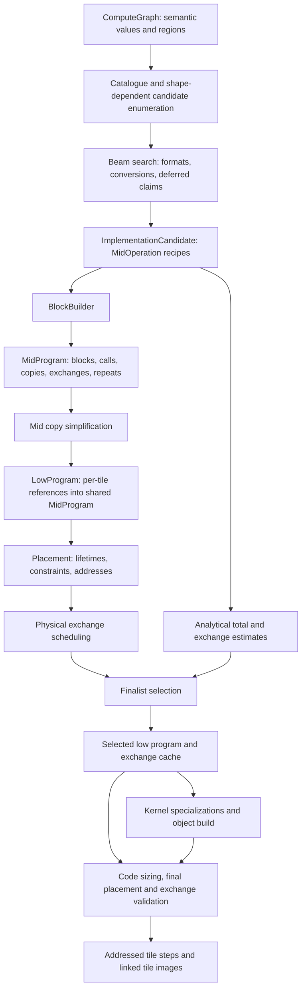
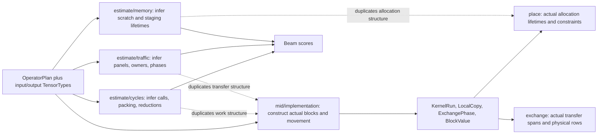
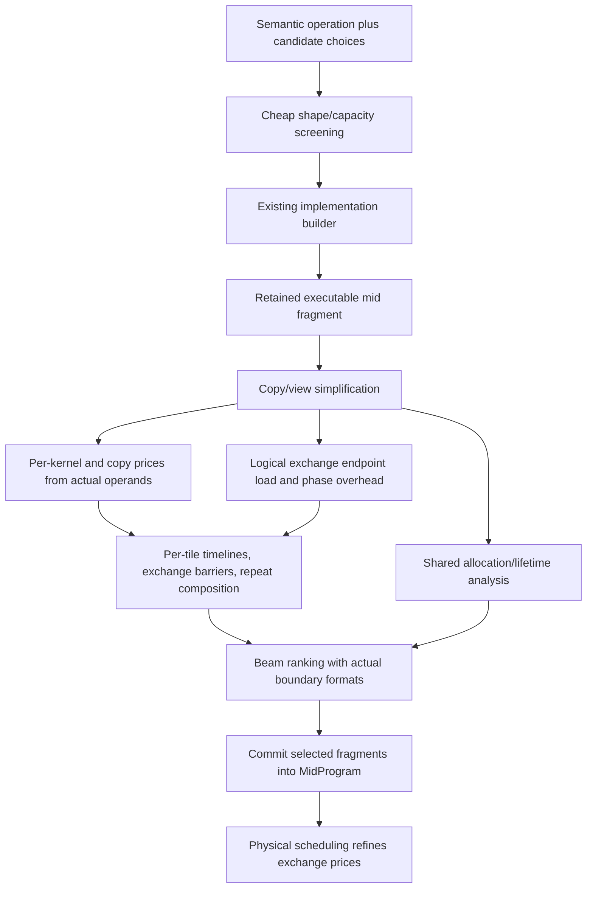
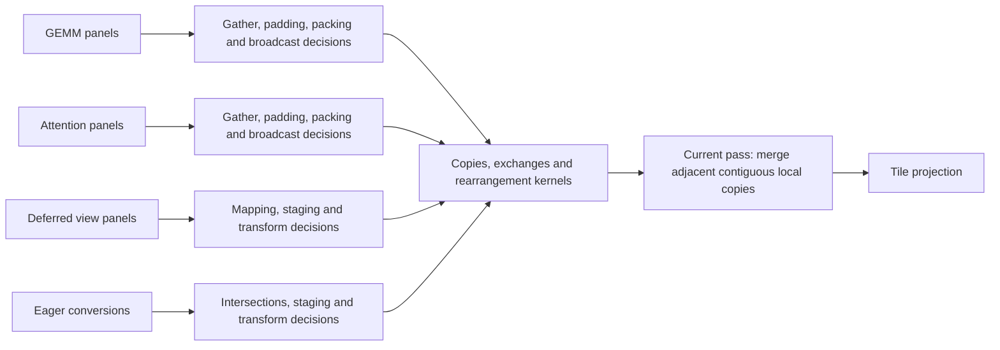

# Compiler data flow and deletion targets

Reviewed against `7045ae4` on 2026-09-05. These are curated data-flow graphs,
not a generated call graph. Solid arrows carry data; dotted arrows identify
duplicated derivations or a proposed dependency. The proposed graph is explicitly
separate from the current implementation.

The existing `ipu-stack-package-callgraph*` artifacts remain useful for historical
navigation, but reference removed `cost`/`operator` modules and types such as
`OperatorRequirements`. They should not be treated as the current architecture.

## Current compiler flow

Sources: [planner](../crates/ipu-codegen/src/mid/planner.rs),
[candidate construction](../crates/ipu-codegen/src/mid/candidates.rs),
[block construction](../crates/ipu-codegen/src/mid/implementation/mod.rs),
[projection](../crates/ipu-codegen/src/low/mod.rs), and
[`select_scheduled_finalist`](../crates/ipu-codegen/src/package.rs).
The kernel-build branch runs for the selected program, not every finalist.
With one finalist, selection skips provisional placement/scheduling.

**Important missing edge:** executable blocks do not feed the compute estimate.
`build_blocks` copies the candidate's estimated totals into `MidProgram`.
Selection subtracts analytical exchange cycles and adds scheduled exchange cycles.
Consequently, exposing compute blocks in mid has not yet eliminated the old
cost model's reconstruction of those blocks.

## Where the implementation is repeated

Concrete duplication, rather than simply similarly named modules:

| Reconstructed fact | Analytical code | Authoritative construction/use |
| --- | --- | --- |
| GEMM block count, per-matrix calls, weight staging and reduction epochs | `cycles::operator_cycles`, `amp_kernel_cycles` | `gemm*`, `emit::append_kernel`, `reduce::append_sum_partials` |
| GEMM panel presence, repacking and remote traffic | `traffic::gemm_uses_panel_buffer`, `gemm_requires_panel_repacking`, `gemm_exchange_endpoint_traffic` | `gemm`, `gemm_streamed`, `gemm_parallel` |
| Attention panels, phase count and scratch | `cycles::attention_endpoint_traffic`, `memory::operator_memory_estimate` | `attention`, `attention_panels`, both attention strategy builders |
| View micro-panel movement and deferred materialization | `cycles::split_head_panel_exchange_cycles`, `deferred_split_input_cycles` | `views`, `deferred`, `mapping` |
| Live storage and alias roots | `memory::region_peak_memory_with_multiplicity` | `place::collect_lifetimes`, alias groups and allocation requirements |

`estimate/{cycles,memory,traffic,tensor}.rs` occupy **2,887 lines** including
inline tests/comments. That is an affected-code inventory, not a claim that all
2,887 lines can be deleted. Target prices, bandwidth models, shared geometry,
and some cheap candidate screening must survive.

## Proposed cost flow

Yes, operator costs should be derived from the mid implementation. The model
should price primitive kernels and movement; it should not independently decide
how an operator is implemented. GEMM inside attention then uses the same GEMM
price function as GEMM elsewhere. Logical and padded extents must remain distinct.
Share address-independent call geometry with `kernel/geometry`, so estimation
and ABI/specialization do not independently recover matrix dimensions.

Timeline evaluation must sum work on each tile between barriers and take the
maximum at an exchange, then charge the exchange. Summing all tile work, or
taking one maximum for the entire program, gives incorrect device latency.
Copies need their actual traversal, memory classes, and launch overhead; traffic
needs multicast/endpoint load, not just summed destination bytes. Repeats need
execution multiplicity, including repeated exchange phases. A repeat without
barriers composes per-tile durations; multiplying a scalar maximum indiscriminately
can introduce synchronization that the program does not have.

There is also a concrete existing scoring concern: `select_scheduled_finalist`
sums each static physical exchange phase once, while `lower_repeat` multiplies
the analytical exchange estimate by repeat count. Replacing that analytical
component with the static sum can undercount repeated communication. This needs
a finalist-ranking regression with a repeat count greater than one; hardware
execution success alone does not validate a planning score.

Adding a second estimator for finalists is only a migration step. To actually
shrink the compiler, use retained mid fragments during detailed beam scoring and
delete the corresponding whole-operator formulas. Keep a small, deliberately
coarse enumeration heuristic ahead of construction. Do not reproduce staging,
reduction or attention algorithms in that heuristic. Such a heuristic is not
automatically an admissible bound; measure candidate loss against a wider search.

The required builder change is substantive: it currently owns a whole candidate,
canonical values, deferred mappings and allocation decisions. Let it construct
a selected operation against explicit boundary values and retain the result.
Use arena checkpoints or shared fragments to avoid cloning entire programs per
branch. Cache only with boundary ownership, formats, alias/materialization state,
and relevant capacity assumptions represented in the key. A cache keyed just by
operator and shape would be unsound. This is an incremental construction API for
the same executable IR, not another operator recipe language.

## Movement flow and another deletion opportunity

The builders already share byte-span traversal and some panel mapping. The
remaining overlap is the orchestration above it. Start with a common operation
that materializes a requested source slice/view into an ordinary destination
block, returning explicit mid work. Keep strategy-specific choices of panel
size, ownership and reuse in GEMM/attention. Delete their duplicated local/remote
gather, zero-padding and pack/broadcast glue as it moves into that operation.
Avoid a generic framework with one hook per existing special case.

The current copy pass cannot remove `A -> temporary -> B`, nor redirect a producer
into B's required layout. Compose view/copy mappings before byte-level expansion,
subject to padding, aliasing, read/write order and precision-conversion semantics.
This can remove both runtime transfers and the special-case code used to avoid
them. A cast is not generally interchangeable with a rearrangement or another cast.

## Representation review and recommended order

1. **Unify primitive costing and allocation analysis, then consume retained mid
   fragments in detailed search.** Delete the operator-shaped estimate branches
   as each strategy migrates. Share address-independent liveness/requirements
   with placement; retain physical allocation, alignment, SRAM element separation,
   and fragmentation checks. A live-byte total cannot replace placement.
2. **Consolidate panel materialization and compose movement.** Replace duplicate
   builder paths, rather than adding a common interface while retaining them.
   Use GEMM, deferred views and both attention strategies as acceptance cases.
3. **Stop passing whole-operator contracts to primitive calls.** `append_kernel`
   currently truncates inherited input requirements, overwrites their formats
   from actual buffers, and prunes separation groups. `OperandRequirement` also
   carries planning-only staging/materialization fields into executable calls.
   Construct primitive access constraints from actual operands and kernel kind;
   keep format negotiation at candidate boundaries. Delete repair logic and
   redundant format copies together, not just rename the contract.
4. **Collapse obsolete allocation labels after sharing liveness.** `LocalCopy`
   in `ShardDefinition` overlaps the explicit copy operation, and `Staging` versus
   `ExchangeStaging` describes historical population policy. They are not all
   cosmetic today: `interleaved_capacity_available` excludes `ExchangeStaging`.
   Replace that heuristic with lifetime-based accounting before merging labels.
5. **Only then reduce incidental wrappers.** `KernelOperand` is a single-field
   wrapper but preserves grouping of multiple views into one ABI operand.
   `TileWorkRef` resolves arena IDs without cloning, and `LowProgram` shares its
   mid program through `Arc`. Removing these offers little compared with the
   duplicated algorithms. Likewise, `ResolvedLayout` is useful shared geometry,
   not a second layout policy to eliminate.

The three repeat representations express different information: semantic region
bindings, concrete block bindings, and per-tile pointer execution. Their existence
alone is not evidence of removable duplication. Diagnostic logical values and
canonical block mappings likewise preserve semantic identities across expansion.

For each change, record production/test line deltas, planning time and peak host
memory, selected strategy, hardware cycles and numerical results. Exercise
streamed/complete reductions, swapped and batched GEMM, tail blocks, both attention
strategies, deferred views and repeated regions. The deletion target matters as
much as a new abstraction: module splitting alone does not make this code smaller.
