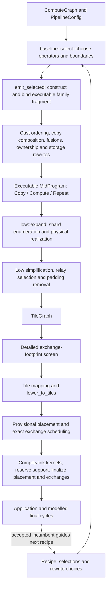
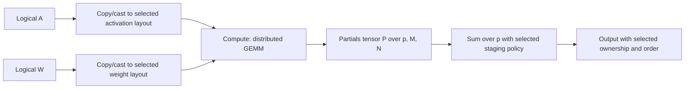
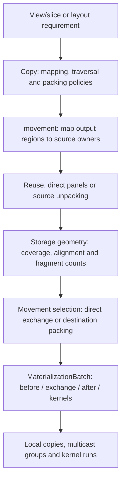

# Compiler data flow

Source review: 2026-09-14, with direct mid construction and low-work ownership incorporated.
This describes the current implementation.
[Structural proposal](COMPILER_STRUCTURE_PROPOSAL.md) describes the proposed changes.
Older experiment reports explain history, not the current pipeline.

## Start here

The public entry point is `build_package` in
[package.rs](../crates/ipu-codegen/src/package.rs). It compiles the runtime, then
calls `package/local::optimize` with a callback that builds a complete package.
Even with zero optimization steps, it constructs and validates a baseline.

The compiler has three principal program representations, but the boundaries
are less clean than their names suggest:

| Representation | What it contains | What remains undecided |
| --- | --- | --- |
| `ComputeGraph` | Shaped semantic operations, parameters, outputs and structured Repeat | Precision, distribution, kernels, movement, storage |
| `MidProgram` | Executable whole-device `Copy`, `Compute` (including casts, products and sums), and `Repeat` | Rewrites, tile calls, physical copy recipes, some staging/alias decisions, routing, addresses |
| `TileGraph` | Shards, relative views, local copies, multicast source/recipient groups, kernel runs, structured control | Physical addresses, exact exchange instructions, linked symbols |
| `LowProgram` | An `Arc<TileGraph>` plus per-tile work indexes and Repeat bindings | Placement and executable construction |
| `ScheduledPlan` | Low program, provisional placement, encoded exchange phases, reusable scheduling choices | Support-memory reservations and their final placement effects |
| `Application` | Tile images, host bindings/protocol, debug/profile metadata | Loading and execution |

Selection emits executable family fragments directly into the program. There
is no `Operator` variant, nested implementation, deferred-input state, or
resolution pass. `Recipe` retains the selected family parameters separately.
Binding validation checks definitions, region scope, arity and alias indices at
construction and rewrite boundaries. Numerical casts have one compute form;
coordinate/layout movement has one Copy form with a selected movement policy.
There is no `Convert` or outer `Primitive` wrapper.

`TileGraph` owns the live operation list and finite-scratch requirement.
`LowProgram` shares its arenas and derives per-tile indexes without changing
execution. Padding removal runs on the graph before this projection; costing,
inventory and emission observe the same live work.

## Production control flow

[baseline::lower](../crates/ipu-codegen/src/mid/baseline.rs) controls the mid
rewrite order. [local::optimize](../crates/ipu-codegen/src/package/local.rs)
keeps a fully validated incumbent. It generates recipes, rebuilds their mid
programs, screens using compact estimated cycles, and evaluates promising
candidates concurrently. It accepts the first improvement in shortlist order,
not the best of an exhaustively evaluated beam. Logical input homes are fixed
from the initial incumbent. A recipe is a search decision record; it is not
another executable representation.

The optional mapping search in
[package/placement.rs](../crates/ipu-codegen/src/package/placement.rs) proposes
one permutation over the entire active tile set. `map_tiles` changes every
shard and local work item together. This preserves their existing ownership
relationships; it cannot choose a different embedding for one operator's
outputs while leaving unrelated values alone. Mid's `tile_offset` and ownership
groups separately provide local rotations. The proposal records scoped owner-map
choices and makes the existing global proposal a joint recipe change; it does
not require searching independent maps immediately.

[validation::expand_and_screen](../crates/ipu-codegen/src/package/validation.rs)
expands each retained candidate and checks transfer geometry before scheduling.
The package callback then accounts for linked code, host support, exchange rows,
profiling and tensor placement. Final addresses can change scheduling, so the
provisional/final cycle is real. Cached ordering and widths are replayed and
validated; cached physical addresses are not assumed valid.

The reported final cycles still combine modelled kernel work with scheduled
exchange horizons. They are not hardware measurements.

## Trace 1: GEMM and its reduction

For `A[M,K] * W[K,N]`, a parallel plan partitions M, N and K. The K partitions
produce independent partial answers:

1. [Candidate generation](../crates/ipu-codegen/src/mid/candidates.rs) and
   [operator plans](../crates/ipu-codegen/src/mid/operator.rs) choose the grid,
   precision, orientation, kernel blocking, result layout and reduction staging.
   [ensure_format](../crates/ipu-codegen/src/mid/lowering.rs) prepares outer
   complete operand formats and numerical casts. Panel requirements leave
   layout movement to the family's copies, without inventing a converted value.
2. [implementation/gemm.rs](../crates/ipu-codegen/src/mid/implementation/gemm.rs)
   builds a compact mid fragment. Parallel GEMM emits ordinary copies, a
   `Compute::Product` with axes/blocking, a leading partials dimension, and
   `Compute::Sum`.
   Output-stationary GEMM instead exposes successive K-panel values and
   accumulating result versions. This is the owner of the distributed algorithm.
3. [emit_selected](../crates/ipu-codegen/src/mid/lowering.rs) binds the fragment
   immediately to actual region values. `append_fragment` remaps IDs without
   selecting or rebuilding an implementation. The later parameter-home
   transformation updates bindings and inserts any input-owner copies as part
   of that same transformation; there is no resolver repairing it afterward.
4. [low/expand/gemm.rs](../crates/ipu-codegen/src/low/expand/gemm.rs)
   binds resident operand windows, enumerates local K/column blocks and batch
   matrices, and chooses the weight-load variant from actual storage. Product
   work accounting uses the final call's extents. Generic kernel append records
   that call without splitting it. These loops do not choose another GEMM grid.
5. `prepare_sum` removes the independent-partials axis from alias views and
   groups matching coordinates. [expand/reduce.rs](../crates/ipu-codegen/src/low/expand/reduce.rs)
   intersects these groups with output ownership, chooses a seed, allocates
   bounded contributor buffers, and emits transfer/reduction stages. It bypasses
   seed or output copies when a compatible physical slice is usable directly.

The current `Compute::Sum` carries a distributed reduction axis and staging
policy; the local `ReductionSum` kernel implements individual stages. Products
have their own compute variant; ordinary kernel compute no longer has optional
product axes. Both retain declared output aliases. Explicit operand indexing and
complete family binding remain in progress.

However, its current implementation is narrower than the name: singleton partial
axis outside the final matrix axes, FP16 contributors/results, matching element
orders, and reduction pieces divisible by eight elements. These checks are split
between `prepare_sum` and `prepare_sum_partials`. They should be presented as
implementation capabilities, not silently treated as the semantics of summation.

## Trace 2: broadcast Add

Take `X[8,4,32] + B[1,4,32]`, with the output sharded over four column owners.
The semantic relation is `Y[b,r,c] = X[b,r,c] + B[0,r,c]`.

| Step | Current owner | Purpose |
| --- | --- | --- |
| Validate broadcasting and infer `[8,4,32]` | [graph.rs](../crates/ipu-codegen/src/graph.rs), `infer_shape`/`broadcast` | Define valid logical computation |
| Select output layout and compatible kernel | [mid/candidates.rs](../crates/ipu-codegen/src/mid/candidates.rs) | Choose distributed implementation |
| Project output ownership onto non-broadcast input axes | [implementation/mod.rs](../crates/ipu-codegen/src/mid/implementation/mod.rs), `pointwise_input_tiling` | Give each owner its corresponding `[1,4,8]` bias slice instead of a whole replicated parameter |
| Select resident shard and crop a broadcast view | [expand/compute.rs](../crates/ipu-codegen/src/low/expand/compute.rs), [pointwise.rs](../crates/ipu-codegen/src/low/expand/pointwise.rs) | Supply the local kernel with the needed coordinates |
| Validate supported broadcast shape and encode strides/counts | [kernel/abi.rs](../crates/ipu-codegen/src/kernel/abi.rs) | Match the actual kernel's address arithmetic |

These steps do different jobs; their existence is not automatically duplication.
The missing connection is a shared operand-indexing contract. Mid records mostly
empty `OperandWindow`s; low recognizes Add/BiasGeLU/AddLayerNorm by kernel name
and infers the relationship again. A new fused kernel can need another exception
in that dispatch. Broadcasting is also inferred for GEMM batch dimensions in a
separate helper.

Physical padding adds a second concern: equal-layout pointwise calls consume the
complete physical panel, whereas broadcasting a singleton axis must use the
logical shape even if storage is borrowed from a larger allocation.
`pointwise.rs` handles both. A logical broadcast map must not erase this distinction.

## Trace 3: mapped copy, unpacking and exchange

A view such as `[B,S,H*D] -> [B*H,S,D]` changes coordinate interpretation. It does
not by itself specify which bytes move or whether storage can be reused.

[movement.rs](../crates/ipu-codegen/src/low/expand/movement.rs) owns the connected
construction. Identity mappings, windows and factor-axis views enter the same
routine. It queries [CopyRegions](../crates/ipu-codegen/src/low/expand/ownership.rs)
for intersecting owners, proves local storage reuse, and inspects physical panel
compatibility. An explicit LocalKernel request uses corresponding resident shards;
other requests constrain physical versus logical traversal. Incompatible requests
are rejected. Unpacking, local packing, shared transfers and compatible loopback
receivers are recorded as ordinary low work before placement.

Numerical conversion is a Compute with a Cast kernel. Copy composition cannot
cross it. It also retains boundaries between incompatible explicit copy policies;
it does not silently replace every selected policy with Automatic.

[storage/movement.rs](../crates/ipu-codegen/src/storage/movement.rs) computes
exact destination coverage, traversal alignment and direct-word fragment counts.
It also owns span-stream matching, shared by local copies and exchange analysis.
Coverage remains symbolic; its cached hole list is only evaluated when a clear
needs it. It does not choose scratch or kernels. `select_destination_packing` in movement
lowering consumes these facts and the Copy's `PackingPolicy`. Automatic retains
the existing cost heuristic; forced direct or staged requests are checked, and
copy composition retains their source/destination boundary. Kernel binding still
needs the broader family-contract refactor. Clear emission widens exact holes to
the fill implementation's write granularity. Relative local-copy descriptors and
launch coalescing remain in low/copy.rs.

Kernel construction still assembles parts of a call in
[expand/emit.rs](../crates/ipu-codegen/src/low/expand/emit.rs); full binding through
families remains to be done. Both kernel and exchange append only record work.
After construction, [low/passes.rs](../crates/ipu-codegen/src/low/passes.rs)
groups exchanges across commuting local copies, then merges adjacent copies.
It checks read/write hazards against completed storage bindings and respects
compute, Repeat and checkpoint boundaries. It compacts the exchange arena and
remaps references in all regions before the relay and padding passes run.

[buffers.rs](../crates/ipu-codegen/src/low/expand/buffers.rs) also mediates borrowed
storage. `full_view` resolves a borrowed binding automatically, while other paths
must call `resolve_read_view` before using physical geometry. That caller-dependent
contract is separate from coordinate mapping and from following storage aliases
with signed byte displacements. The proposal makes this access boundary explicit
alongside movement and kernel binding.

## What each later representation is for

- `KernelRun` retains relative views, kernel specification and access requirements.
  It is not yet a fully checked executable call: ABI validation, specialization,
  scalar construction and some view-contiguity checks occur later in `kernel`.
- `LogicalExchange` stores one source with multiple recipient views. Physical
  addresses, message lengths, pairing and hazard ordering are resolved in
  [codegen/exchange.rs](../crates/ipu-codegen/src/exchange.rs). The encoding and
  timed-program builder live in [ipu-exchange](../crates/ipu-exchange/src/lib.rs).
- [place.rs](../crates/ipu-codegen/src/place.rs) derives lifetimes, aliases,
  access tails, element-separation constraints and addresses. Parameters remain
  resident across host invocations. `storage_group` in mid concerns ownership
  mapping; it does not itself mean two values alias the same allocation.
- Repeat remains structured throughout. Mid retains body and value sequences;
  low builds carried/invariant/iterated bindings; placement establishes sequence
  strides; tile emission uses advancing pointers, base relocation and patches.
  It is not implemented by compiling 27 unrelated bodies.
- [kernel::materialize_kernel_run](../crates/ipu-codegen/src/kernel/mod.rs)
  binds relative views to placed or Repeat-relative addresses.
  [tile.rs](../crates/ipu-codegen/src/tile.rs) builds `TileProgram`s;
  [codegen/lib.rs](../crates/ipu-codegen/src/lib.rs) emits supervisor instructions.
  The package builder assembles executable images and host-visible metadata.

## Trace 4: live low work and storage contracts

[initialization.rs](../crates/ipu-codegen/src/low/initialization.rs) removes proven
redundant padding clears from `TileGraph.body`, including Repeat bodies, at the
end of expansion. Its analyses walk live operations, not unused arena entries.
The graph records whether the remaining work requires finite initial scratch.
[lower_to_tiles](../crates/ipu-codegen/src/low/mod.rs) subsequently derives tile
work and Repeat instances without removing calls. Repeat's storage binding record
is shared by both representations.

| Consumer | Execution description used |
| --- | --- |
| Final `scheduled_program_cycles` in [estimate/program.rs](../crates/ipu-codegen/src/estimate/program.rs), called by package construction | Transformed `BlockRegion` operations |
| [KernelBuildPlan](../crates/ipu-codegen/src/kernel/build.rs), runtime-symbol retention and tile emission | Per-tile indexes of those operations, including Repeat bodies |
| Placement lifetimes and kernel access collection | The same indexed operations through `TileWorkRef` |

Before this refactor, padding removal edited only projected work. A diagnostic
showed 1,402 reported cycles versus 1,390 for work actually retained. The permanent
regression test now checks agreement between graph cost and projected execution,
with and without Repeat, and checks that padding removal is idempotent.

Repeat storage now has one sizing owner:
[expand/repeat.rs](../crates/ipu-codegen/src/low/expand/repeat.rs) declares which
values form each sequence, without scanning mid for GEMM-specific requirements.
Placement combines the actual calls' alignment/tail requirements and aliases,
chooses the reservation, validates every sequence member and returns its stride.
Tile emission consumes `Placement.sequence_strides`; it does not infer stride
from consecutive addresses. Empty shards can have zero stride. Tests exercise
additional non-GEMM access requirements, single-iteration sequences and both
physical SRAM regions.

Kernel results have one indexed representation: `KernelRun.outputs` binds every
result before the call is interned, and `KernelRequirements.outputs` describes
the corresponding accesses. `MemoryOperand::Output(index)` can name any result
in an element-separation constraint. Placement, lifetimes and ABI validation use
these same bindings. The worker ABI's register order still puts result zero
before inputs and subsequent results; that calling convention does not divide
the storage model into primary and additional outputs.

The shifted FP16-to-FP8 cast similarly separates access geometry from the
optimization that requests it. [kernel/cast.rs](../crates/ipu-codegen/src/kernel/cast.rs)
defines the output prefix and safe chunks; mid donation, low call construction
and costing consume that description. The mid rewrite separately requires a net
storage saving on each shard. A physically valid cast need not be profitable.

Other physical access contracts still have multiple owners:

- [attention construction](../crates/ipu-codegen/src/mid/implementation/attention.rs)
  places FP32 statistics after probabilities inside a nominal F16/FP8 tensor.
  It crops probability copies to exclude the statistics; finite-padding reuse
  separately rejects attention kernels because their writes are not all F16.
- `tile::local_copy_call` selects copy helpers and arguments. Runtime inventory
  reuses that selection, but placement alignment and local-copy costing use
  separate rules instead of a common checked helper binding.

## Trace 5: exchange words back to relocation sites

The exchange builder emits instruction words. Later,
[exchange/relocation.rs](../crates/ipu-codegen/src/exchange/relocation.rs) invokes
`sender_address_instruction_groups` to scan those words for SEND and paired-send
restarts and recover offsets relative to each outgoing message. It matches the
groups back to scheduled send activities for Repeat relocation. Its base fallback
also invokes the diagnostic decoder to locate OUTGOING_BASE writes.

[ipu-exchange](../crates/ipu-exchange/src/lib.rs) separately implements
`normalized_exchange_address_words`, recognizing send and receive address fields
for cache replay and row sharing. `tile::layout_exchange_rows` normalizes each
row in both its counting and placement passes, then compares normalized and
original words to collect address-patch positions. These are production uses of
instruction interpretation, beyond the independent validation/diagnostic decoder.
The proposal retains relocation sites during encoding instead of discarding and
recovering them. The independent decoder remains useful for verification and SDK
captures.

## Costs and caches

Compact costing reads layouts and mid primitives; detailed costing reads tile
geometry/timelines; scheduled costing substitutes real exchange horizons. Sharing
kernel formulae does not make the first two equivalent. In particular, mid's
`Sum` scratch/traffic formula approximates choices subsequently made by physical
reduction lowering.

| Cache or retained analysis | Contents and key | Lifetime / owner |
| --- | --- | --- |
| `implementation::FragmentCache` | `(OperatorPlan, actual input types, output type)` to executable mid fragment | Owned by the search invocation, passed explicitly to construction/selection; foldhash and per-key `OnceLock` |
| `MemoizedCostModel.rearrangements` | Shape, precision, strategy, source/destination layouts to coarse price | Same search; foldhash and `OnceLock` |
| `ExpansionCache.geometry` | Byte interpretation, extents and ordered mappings to coverage/alignment/fragment facts; excludes ownership and packing policy | Same search in production; bounded at 32,768 entries |
| `ExpansionCache.copies` | Normalized view geometry, copy order, same-buffer flag to relative local-copy descriptors | Same search; separately bounded at 32,768 entries |
| `GeometryAnalysis` | Interned view traversals and source/recipient pair facts: bytes, fragments, receive spans | One candidate's expansion and footprint screen; also used to price tentative relays |
| `CopyRegions.targets` | Requested logical region to clipped source regions/replica owners | One source set during a copy or conversion; avoids repeating intersection work for replicas |
| `TileGraphBuilder.kernel_metadata` | Shared provenance/kernel/format access contracts, found by linear lookup | One expansion; operand views remain per call |
| Timeline `KernelCosts` | Interned call metadata plus physical widths to cycles | One timeline evaluation |
| `ExchangeScheduleCache` | Phase-indexed structure fingerprint, widths, order, normalized encoded rows and the policy under which they were selected | Incumbent plus speculative candidate snapshots; policy compatibility and physical replay are validated |
| ELF artifact cache | Source/includes, effective flags, target and tool identity to immutable compiled objects | On disk across builds |

[ExpansionCache](../crates/ipu-codegen/src/low/expand/cache.rs) uses foldhash and
`hashbrown::HashTable`, with full key equality. Borrowed lookups avoid allocating
owned mapping lists on hits. Generation stays outside the lock; entries remain
bounded. [GeometryAnalysis](../crates/ipu-codegen/src/estimate/geometry.rs) still
uses standard hash maps. These are not all caches of the same computation.
Family fragments are built by the constructor and consumed by costing;
`CostModel` no longer constructs or caches executable programs.

`borrowed_views` is different: it records storage substitutions made during
expansion. It is mutable lowering state, not a memoization cache, and cannot be
shared between candidates.

Exchange selection receives `stream_words` explicitly from the pipeline policy,
separately from the cache. The cache records which policy produced each entry;
a policy change cannot reuse an earlier selection. The public
`select_exchange_schedule` entry point applies this same production selection to
captured transfers. Current defaults, search coverage and checkpoint configuration
remain unchanged.

The overlapping work is constructing, normalizing and matching byte geometry in
copy realization and geometry costing. Destination geometry no longer retains
cost-dependent staging decisions; changing the packing policy reuses those facts.
The fragment width is fixed by the IPU21 exchange target for this cache's lifetime.

[Historical cache measurements](LOW_FRAGMENT_CACHE_2026_09_09.md) found a useful
MLP B2 improvement, marginal attention changes, and rejected broader fragment
caches. Those measurements have not been rerun for this review. Deleting caches
because their names overlap would discard evidence, not simplify the data flow.
