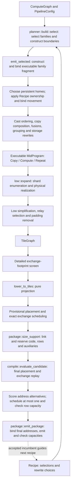
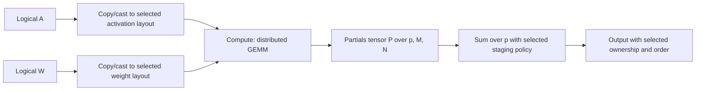
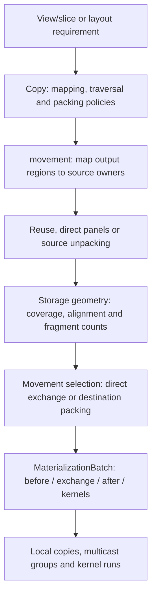

# Compiler data flow

Source review: 2026-09-14, with direct mid construction and low-work ownership incorporated.
This describes the current implementation.
[Structural proposal](COMPILER_STRUCTURE_PROPOSAL.md) describes the proposed changes.
Older experiment reports explain history, not the current pipeline.

## Start here

The public entry point is `build_package` in
[lib.rs](../crates/ipu-codegen/src/lib.rs). Its `compile_graph` routine
compiles the runtime and builds an executable baseline. It
calls `evaluate_candidate` directly for the incumbent and shortlisted alternatives.
Even with zero optimization steps, the baseline must produce a complete package.

The driver ends at package assembly. [supervisor.rs](../crates/ipu-codegen/src/supervisor.rs)
owns the address-resolved `TileProgram` and emits its supervisor instructions.
Before emission, [supervisor/validate.rs](../crates/ipu-codegen/src/supervisor/validate.rs)
checks structural constraints (including Repeat pointer scope and patch shapes)
and collects unique exchange rows. Emission consumes those checked rows;
package assembly serializes them without rebuilding or revalidating the table.
Instruction encoding and symbol resolution remain emission errors, since they
depend on the generated code and linked runtime rather than program structure.

The compiler has three principal program representations, but the boundaries
are less clean than their names suggest:

| Representation | What it contains | What remains undecided |
| --- | --- | --- |
| `ComputeGraph` | Shaped semantic operations, parameters, outputs and structured Repeat | Precision, distribution, kernels, movement, storage |
| `MidProgram` | Executable whole-device `Copy`, `Compute` (including casts, products and sums), and `Repeat` | Rewrites, tile calls, physical copy recipes, some staging/alias decisions, routing, addresses |
| `TileGraph` | Shards, relative views, local copies, multicast source/recipient groups, kernel runs, structured control | Physical addresses, exact exchange instructions, linked symbols |
| `LowProgram` | An `Arc<TileGraph>` plus per-tile work indexes and Repeat bindings | Placement and executable construction |
| `EvaluatedCandidate` | Driver result: low program, final placement/exchanges, application, cost and accepted cache | No unresolved compilation work; search may replace the complete result |
| `Application` | Tile images, host bindings/protocol, debug/profile metadata | Loading and execution |

Selection emits executable family fragments directly into the program. There
is no `Operator` variant, nested implementation, deferred-input state, or
resolution pass. `Recipe` retains the selected family parameters separately.
The public `MidOperator` compatibility name aliases planner's `OperatorFamily`;
it is not an executable mid node.
Binding validation checks definitions, region scope, arity and alias indices at
construction and rewrite boundaries. Numerical casts have one compute form;
coordinate/layout movement has one Copy form with a selected movement policy.
There is no `Convert` or outer `Primitive` wrapper.

[tensor](../crates/ipu-codegen/src/tensor.rs) owns shapes, coordinate relations,
formats, layouts and resolved ownership geometry. Graph construction, mid,
storage traversal and kernel binding import these descriptions from that owner.
Cast-motion layout preferences remain in [mid/cast_order.rs](../crates/ipu-codegen/src/mid/cast_order.rs),
separate from the represented layouts; rearrangement availability comes from
the kernel family's supported destination table. Low's root no longer imports
and implicitly exposes every mid definition to its children.

`TileGraph` owns the live operation list and finite-scratch requirement.
`LowProgram` shares its arenas and derives per-tile indexes without changing
execution. Padding removal runs on the graph before this projection; costing,
inventory and emission observe the same live work.

## Target and runtime contracts

[ipu-target](../crates/ipu-target/src/lib.rs) is a dependency leaf. Its IPU21
modules own SRAM geometry, register IDs, supervisor instruction encoding and
physical routing/pairing. Its C600 module supplies the compute-tile inventory.
`Topology` describes physical tile identities; [exchange construction](../crates/ipu-codegen/src/exchange/program.rs)
takes that topology to construct multicast and point-to-point programs. Timing
selection, row encoding and measured scheduling margins remain in exchange.

[loader_abi](../crates/ipu-package/src/loader_abi.rs) defines the SDK secondary
loader's frame sizes, startup handoff and loadable address limit. Package
validation and the driver consume those definitions. The limit is smaller than
architectural SRAM and is not a target-capacity constant. Codegen imports this
ABI directly and has no dependency on the driver.

[runtime_layout](../crates/ipu-codegen/src/runtime_layout.rs) supplies the resident
runtime's window, descriptor and stack conventions. Host packet encoding receives
the configured window base; it does not select a runtime address. Rust and
[static_runtime.S](../device/static_runtime.S) read the same `.def` inputs for
register IDs, supervisor opcodes and runtime layout. [build/abi.rs](../build/abi.rs)
generates the Rust declarations; assembly includes the inputs through `.set`.

## Production control flow

[planner::build_candidate](../crates/ipu-codegen/src/planner/build.rs) controls the mid
rewrite order. [compile_graph](../crates/ipu-codegen/src/lib.rs)
keeps a fully evaluated incumbent. [planner/proposals.rs](../crates/ipu-codegen/src/planner/proposals.rs)
generates recipes without evaluating packages; the driver rebuilds their mid
programs, screens using compact estimated cycles, and evaluates promising
candidates concurrently. It accepts the first improvement in shortlist order,
not the best of an exhaustively evaluated beam. Logical input homes are fixed
from the initial incumbent. A recipe is a search decision record; it is not
another executable representation.

The source sequence for high-to-mid construction is explicit: `planner/build.rs`
walks operations and regions, `planner/candidates.rs` supplies choices, and
`planner/bind.rs` prepares complete input formats and commits the chosen family.
`planner/fragments.rs` dispatches to the connected GEMM, attention and layernorm
constructors and supplies their shared copy/cast/compute builder. The cache holds
ordinary executable `MidProgram`s keyed by the selected plan and complete input
and output types. `mid/fragment.rs` substitutes those bindings; it does not resolve
another representation. Persistent parameter-home selection belongs to
`planner/parameter_homes.rs`, while selected executable owner rewrites remain in
`mid/ownership.rs`. Cross-module imports name their owners instead of inheriting
planner/tensor/configuration names through the mid module.

Whole-program settings live in `Recipe.options` in
[planner/recipe.rs](../crates/ipu-codegen/src/planner/recipe.rs): early FP8 casts,
cast-buffer reuse, packing row size, reduction-group limit, disjoint preparation,
and a device tile permutation. Operator layout selections remain in `Recipe.plans`.
`Candidate` holds the executable program, recipe, and alternative operator layouts.
There are no named work identities, override maps, or available-choice inventories.

[planner/build.rs](../crates/ipu-codegen/src/planner/build.rs) constructs mid,
moves casts when enabled, composes copies, applies elementwise fusion and the
optional packing/grouping/donation passes, then applies the tile permutation and
costs the result. Each pass determines where its global option can legally apply.
Cast donation retains live-input and Repeat protections. Packing retains the
original destination and uses a larger workspace only when its layout is feasible.
Grouping checks dependencies and physical tile overlap within each Repeat region.

Mid values retain [OwnerMap](../crates/ipu-codegen/src/tensor/owners.rs) embeddings;
removing recipe overrides does not restrict the tensor representation to flat tile
ranges. Grouping moves aliases together, preserving their relative rotations.
[Ownership binding](../crates/ipu-codegen/src/mid/ownership.rs) inserts copies for
compute operands that need a result's owners and restores carried Repeat homes.

[planner/proposals.rs](../crates/ipu-codegen/src/planner/proposals.rs) proposes global
option changes alongside operator layouts and boundary changes. Its tile-mapping
proposal retains the existing block-transpose neighborhood and fabric-load ranking.
Checkpoint version eight records the global options; older schemas are rejected
without migration. Local optimization of these options is intentionally absent.

Fragment binding receives an explicit working embedding for unbound temporary
groups. Input and result groups retain their separate, checked homes. A small
result subset therefore cannot accidentally restrict a larger workspace. The
planner currently supplies the ordinary device embedding; this argument is a
binding contract, not an additional mapping search.

[evaluate_candidate](../crates/ipu-codegen/src/lib.rs)
expands each retained candidate and checks transfer geometry before scheduling.
`evaluate_candidate` keeps provisional addresses local while
[package/support.rs](../crates/ipu-codegen/src/package/support.rs) measures and
reserves linked code, host/tile programs, rows, descriptors and profiling storage.
Sizing never places tensors or schedules exchanges. The driver performs final
placement and exchange replay using the normal allocator's result.
Package emission consumes the retained result and checks all measured capacities.

The provisional/final passes remain necessary: support changes available addresses,
and addresses can change hazards and row sharing. Each speculative candidate owns
its schedule-cache snapshot; only the winner's final cache is promoted. The former
`ScheduledPlan`, separate `BuiltApplication`, `validate` wrapper and finalization
callback are removed. Attempt counts and visited recipes are local to the driver;
search always starts from the baseline. The graph builder, family choices/catalogues,
fragment cache and direct construction live under
[planner](../crates/ipu-codegen/src/planner/mod.rs).
[config.rs](../crates/ipu-codegen/src/config.rs) owns pipeline
configuration. Mid contains executable semantics, binding and rewrites. Mapping proposals use the global recipe permutation.

The reported final cycles still combine modelled kernel work with scheduled
exchange horizons. They are not hardware measurements.

## Trace 1: GEMM and its reduction

For `A[M,K] * W[K,N]`, a parallel plan partitions M, N and K. The K partitions
produce independent partial answers:

1. [Candidate generation](../crates/ipu-codegen/src/planner/candidates.rs) and
   [operator plans](../crates/ipu-codegen/src/planner/operator.rs) choose the grid,
   precision, orientation, kernel blocking, result layout and reduction staging.
   [ensure_format](../crates/ipu-codegen/src/planner/bind.rs) prepares outer
   complete operand formats and numerical casts. Panel requirements leave
   layout movement to the family's copies, without inventing a converted value.
2. [planner/gemm.rs](../crates/ipu-codegen/src/planner/gemm.rs)
   builds a compact mid fragment. Parallel GEMM emits ordinary copies, a
   `Compute::Product` with axes/blocking, a leading partials dimension, and
   `Compute::Sum`.
   Output-stationary GEMM instead exposes successive K-panel values and
   accumulating result versions. This is the owner of the distributed algorithm.
3. [emit_selected](../crates/ipu-codegen/src/planner/bind.rs) binds the fragment
   immediately to actual region values. [append_fragment](../crates/ipu-codegen/src/mid/fragment.rs)
   checks both input and result types, remaps nested Repeat bindings, and preserves
   storage groups and relative ownership. A returned input is connected to a
   distinct caller result by an explicit identity copy. Binding selects no algorithm
   and leaves caller state untouched on failure. The later parameter-home
   transformation updates bindings and inserts any input-owner copies as part
   of that same transformation; there is no resolver repairing it afterward.
4. [low/expand/gemm.rs](../crates/ipu-codegen/src/low/expand/gemm.rs)
   binds resident operand windows, enumerates local K/column blocks and batch
   matrices, and chooses the weight-load variant from actual storage. Product
   work accounting uses the final call's extents. Generic kernel append records
   that call without splitting it. These loops do not choose another GEMM grid.
5. `prepare_sum` removes the independent-partials axis from alias views and
   groups matching coordinates. [expand/reduce.rs](../crates/ipu-codegen/src/low/expand/reduce.rs)
   intersects these groups with output ownership, chooses a seed, allocates
   bounded contributor buffers, and emits transfer/reduction stages. It bypasses
   seed or output copies when a compatible physical slice is usable directly.

The current `Compute::Sum` carries a distributed reduction axis and staging
policy; the local `ReductionSum` kernel implements individual stages. Products
have their own compute variant; ordinary kernel compute no longer has optional
product axes. Both retain declared output aliases. Fragment substitution now checks complete
boundaries; the remaining kernel storage/access contracts are described below.

However, its current implementation is narrower than the name: singleton partial
axis outside the final matrix axes, FP16 contributors/results, matching element
orders, and reduction pieces divisible by eight elements. These checks are split
between `prepare_sum` and `prepare_sum_partials`. They should be presented as
implementation capabilities, not silently treated as the semantics of summation.

## Trace 2: broadcast Add

Take `X[8,4,32] + B[1,4,32]`, with the output sharded over four column owners.
The semantic relation is `Y[b,r,c] = X[b,r,c] + B[0,r,c]`.

| Step | Current owner | Purpose |
| --- | --- | --- |
| Validate broadcasting and infer `[8,4,32]` | [graph.rs](../crates/ipu-codegen/src/graph.rs), `infer_shape`, using [tensor.rs](../crates/ipu-codegen/src/tensor.rs) | Define valid logical computation |
| Select output layout and compatible kernel | [planner/candidates.rs](../crates/ipu-codegen/src/planner/candidates.rs) | Choose distributed implementation |
| Project output ownership onto non-broadcast input axes | [tensor/resolved.rs](../crates/ipu-codegen/src/tensor/resolved.rs), `broadcast_operand_tiling` | Give each owner its corresponding `[1,4,8]` bias slice instead of a whole replicated parameter |
| Bind the declared operand relation to a resident fragment | [expand/compute.rs](../crates/ipu-codegen/src/low/expand/compute.rs), `elementwise_view` | Supply the local kernel with the needed coordinates |
| Validate supported broadcast shape and encode strides/counts | [kernel/pointwise.rs](../crates/ipu-codegen/src/kernel/pointwise.rs), `call` | Match the actual kernel's address arithmetic |

Mid records `OperandIndexing`: an elementwise relation to a specified result, or
a whole local fragment with an optional window. Graph validation, ownership
projection and low binding share the broadcast relation in `tensor.rs`; low
does not recognize Add/BiasGeLU/AddLayerNorm names. Local fragment indexing is
explicit for attention panels and feature statistics whose domains differ from
their output. Multiple results share the invocation distribution and are paired
by their fragment order on each owner. Residual/statistics fusion indexes its
inputs against the residual result, not the differently shaped statistics.
GEMM batch binding also uses the shared logical relation: a singleton shard of a
non-singleton batch dimension is not a broadcast dimension.

Physical padding adds a second concern: equal-layout pointwise calls consume the
complete physical panel, whereas broadcasting a singleton axis must use the
logical shape even if storage is borrowed from a larger allocation.
The declared elementwise binding retains complete source panels when the logical
fragment is unchanged; a proper subregion retains its backing strides. Kernel
family validation still decides which such views its address arithmetic supports.

## Trace 3: mapped copy, unpacking and exchange

A view such as `[B,S,H*D] -> [B*H,S,D]` changes coordinate interpretation. It does
not by itself specify which bytes move or whether storage can be reused.

[movement.rs](../crates/ipu-codegen/src/low/expand/movement.rs) owns the connected
construction. Identity mappings, windows and factor-axis views enter the same
routine. It queries [CopyRegions](../crates/ipu-codegen/src/low/expand/ownership.rs)
for intersecting owners, proves local storage reuse, and inspects physical panel
compatibility. An explicit LocalKernel request uses corresponding resident shards;
other requests constrain physical versus logical traversal. Incompatible requests
are rejected. Unpacking, local packing, shared transfers and compatible loopback
receivers are recorded as ordinary low work before placement.

Numerical conversion is a Compute with a Cast kernel. Copy composition cannot
cross it. It also retains boundaries between incompatible explicit copy policies;
it does not silently replace every selected policy with Automatic.

[storage/geometry.rs](../crates/ipu-codegen/src/storage/geometry.rs) shares normalized
views, matched copy rows and exact destination coverage between movement and
costing. [storage/movement.rs](../crates/ipu-codegen/src/storage/movement.rs) owns
span-stream matching and coverage subtraction. Hole lists are evaluated only when
a selected realization needs clearing. These facts do not choose scratch or kernels.
`select_destination_packing` consumes them with the Copy's `PackingPolicy`.
Clear emission widens exact holes to the fill implementation's write granularity.
The [copy family](../crates/ipu-codegen/src/kernel/copy.rs) owns launch coalescing,
helper selection and binding against actual backing storage.

Kernel construction resolves read views in
[buffers.rs](../crates/ipu-codegen/src/low/expand/buffers.rs), then calls
`KernelRun::bind` in [kernel/binding.rs](../crates/ipu-codegen/src/kernel/binding.rs).
That owner interns access requirements and checks the family call and relative
physical views before the call enters low. GEMM
batch selection and shifted cast chunking select the final views first; neither
mutates an already bound call. Both kernel and exchange append only record work.
`KernelRun::call` dispatches to the family once. The family checks its formats and
shape and returns a complete `KernelImplementation` key plus encoded arguments.
Build inventory and final emission consume that same description. The former
ABI lookup, symbolic scalar-getter list and specialization reconstruction are
removed. Fixed entry points and parameterized implementations use one identity
enum; there is no unspecified specialization for another pass to discover.
FP8 output epilogues share their contract with mid fusion, and optimistic cast
and packing queries use their families' capabilities. Local byte copies bind
through [kernel/copy.rs](../crates/ipu-codegen/src/kernel/copy.rs): movement
construction supplies the byte geometry, and `CopyRun` checks its ranges and
selects the helper before append. Placement, costing, runtime symbol retention
and emission consume that binding. Coalescing explicitly rebinds the changed
descriptor.
After construction, [low/passes.rs](../crates/ipu-codegen/src/low/passes.rs)
groups exchanges across commuting local copies, then merges adjacent copies.
It checks read/write hazards against completed storage bindings and respects
compute, Repeat and checkpoint boundaries. It compacts the exchange arena and
remaps references in all regions before the relay and padding passes run.

[buffers.rs](../crates/ipu-codegen/src/low/expand/buffers.rs) binds logical values
to concrete `ShardView`s. A borrowed copy replaces the result's binding with its
source selection; subsequent consumers receive that view before inspecting
geometry. `full_view` only describes a complete physical allocation. The separate
borrowed-view map and late read-repair calls are removed. Low retains these value
views, including selections, and diagnostic reads use them too.

Logical shapes remain in `logical_values`: a scalar borrowed from a larger buffer
still broadcasts as a scalar. Backing extents remain on the physical shard, so
the scalar or cropped rows do not acquire a fictitious dense stride. Copy-region
ownership indexes source views, allowing several selections of one backing shard.
Compute dispatch declares its current canonical-allocation needs (Sum's axis
reinterpretation and in-place results); Repeat declares its structured bindings.
Both validate complete storage where required.

[low/storage.rs](../crates/ipu-codegen/src/low/storage.rs) owns physical access
binding. `ShardView::bind` checks the selected region and backing allocation, then
returns its format/strides, selection and signed origin in that allocation.
Kernels, movement, exchange expansion and detailed geometry costing use this
binding. Following an alias changes the byte origin; it never reinterprets FP8
data using the FP16 backing allocation's format. Copy preparation distinguishes
disjoint allocations from aliases before reordering spans. Dependency checks
translate both accesses into common byte coordinates, including negative origins.

The same owner resolves placed addresses and Repeat pointers. It retains the
alias chain so a Repeat override on an intermediate argument takes precedence
over a more distant backing value. Kernel calls, local copies and exchange-base
setup use that resolution with their selected byte offset.

Runtime copy helpers take ordinary source/destination/count arguments, including
halfword copies. The old halfword inline-address table and its special batching
path in the general emitter are removed. The emitter only constructed that table
for calls copying a single halfword between absolute addresses; it disagreed
with the copy selector's advertised support for longer and Repeat-relative
copies. The hardware copy checker covers both forms, alignment combinations and
untouched source/destination bytes.

## What each later representation is for

- `KernelRun` retains checked relative views, kernel specification and shared
  access requirements. Binding validates the implementation identity, scalar
  values and physical view interpretation before placement.
  Those cheap derived fields are not copied into every call. Final emission
  uses the same derivation and adds placed or Repeat-relative base addresses.
- `LogicalExchange` stores one source with multiple recipient views. Physical
  addresses, message lengths, pairing and hazard ordering are resolved in
  [codegen/exchange.rs](../crates/ipu-codegen/src/exchange.rs). The encoding and
  timed-program builder live in [exchange encoding](../crates/ipu-codegen/src/exchange/program.rs).
- [place.rs](../crates/ipu-codegen/src/place.rs) derives lifetimes, aliases,
  access tails, element-separation constraints and addresses. Parameters remain
  resident across host invocations. `storage_group` in mid concerns ownership
  mapping; it does not itself mean two values alias the same allocation.
- Repeat remains structured throughout. Mid retains body and value sequences;
  low builds carried/invariant/iterated bindings; placement establishes sequence
  strides; tile emission uses advancing pointers, base relocation and patches.
  It is not implemented by compiling 27 unrelated bodies.
- [kernel::materialize_kernel_run](../crates/ipu-codegen/src/kernel/mod.rs)
  binds relative views to placed or Repeat-relative addresses.
  [tile.rs](../crates/ipu-codegen/src/tile.rs) builds `TileProgram`s;
  [codegen/lib.rs](../crates/ipu-codegen/src/lib.rs) emits supervisor instructions.
  The package builder assembles executable images and host-visible metadata.

## Trace 4: live low work and storage contracts

[initialization.rs](../crates/ipu-codegen/src/low/initialization.rs) removes proven
redundant padding clears from `TileGraph.body`, including Repeat bodies, at the
end of expansion. Its analyses walk live operations, not unused arena entries.
The graph records whether the remaining work requires finite initial scratch.
[lower_to_tiles](../crates/ipu-codegen/src/low/mod.rs) subsequently derives tile
work and Repeat instances without removing calls. Repeat's storage binding record
is shared by both representations.

| Consumer | Execution description used |
| --- | --- |
| Final `scheduled_program_cycles` in [estimate/program.rs](../crates/ipu-codegen/src/estimate/program.rs), called by package construction | Transformed `BlockRegion` operations |
| [KernelBuildPlan](../crates/ipu-codegen/src/kernel/build.rs), runtime-symbol retention and tile emission | Per-tile indexes of those operations, including Repeat bodies |
| Placement lifetimes and kernel access collection | The same indexed operations through `TileWorkRef` |

Before this refactor, padding removal edited only projected work. A diagnostic
showed 1,402 reported cycles versus 1,390 for work actually retained. The permanent
regression test now checks agreement between graph cost and projected execution,
with and without Repeat, and checks that padding removal is idempotent.

Repeat storage now has one sizing owner:
[expand/repeat.rs](../crates/ipu-codegen/src/low/expand/repeat.rs) declares which
values form each sequence, without scanning mid for GEMM-specific requirements.
Placement combines the actual calls' alignment/tail requirements and aliases,
chooses the reservation, validates every sequence member and returns its stride.
Tile emission consumes `Placement.sequence_strides`; it does not infer stride
from consecutive addresses. Empty shards can have zero stride. Tests exercise
additional non-GEMM access requirements, single-iteration sequences and both
physical SRAM regions.

Kernel results have one indexed representation: `KernelRun.outputs` binds every
result before the call is interned, and `KernelRequirements.outputs` describes
the corresponding accesses. `MemoryOperand::Output(index)` can name any result
in an element-separation constraint. Placement, lifetimes and ABI validation use
these same bindings. The worker ABI's register order still puts result zero
before inputs and subsequent results; that calling convention does not divide
the storage model into primary and additional outputs.
Inputs likewise bind directly to `ShardView`s. The former `KernelOperand` wrapper
allocated a list per input, although every implemented ABI required exactly one
view. Removing it leaves physical strides and packed views intact, and removes
the nested loops and impossible multiple-view operand state from consumers.

The shifted FP16-to-FP8 cast similarly separates access geometry from the
optimization that requests it. [kernel/cast.rs](../crates/ipu-codegen/src/kernel/cast.rs)
defines the output prefix and safe chunks; mid donation, low call construction
and costing consume that description. The mid rewrite separately requires a net
storage saving on each shard. A physically valid cast need not be profitable.

[Attention construction](../crates/ipu-codegen/src/planner/attention.rs) emits
softmax as a compute with typed results: probabilities, FP32 maxima/denominators,
FP32 segment workspace, and an FP16 tail workspace when FP8 masking needs it.
The [attention family](../crates/ipu-codegen/src/kernel/attention.rs) declares
their row geometry and validates the complete local call. It supplies separate
pointers to assembly; no adjacency or separation between memory elements is
required. PV consumes the probability result directly, and merge consumes the
statistics. Later blocks reuse the two persistent results through ordinary
result aliases. Padding reuse therefore checks actual storage types, without
recognizing attention kernel names. The initial merge has no previous-state
operand; the family fills its unused ABI slot when emitting the call.

Local copies share raw `StorageAccess` requirements with numerical kernels,
without fabricating tensor formats for their byte movement. Halfword copies
reserve the possible two-byte read/modify/write tail of the runtime helper.
Their family supplies the detailed cost for the selected scalar or worker loop;
mid retains a coarser launch allowance before selection. The late tile helper
selector and its separate screening pass are removed. Logical useful-work
coverage for copies still needs to distinguish physical padding bytes.

## Trace 5: exchange encoding retains relocation sites

[Exchange construction](../crates/ipu-codegen/src/exchange/program.rs) prepares each transfer
with its caller-assigned message identity. The phase encoder returns an
[`EncodedRow`](../crates/ipu-codegen/src/exchange/program/row.rs): instruction words, send address
sites with message-relative offsets and item widths, receive-pointer sites, and
outgoing-base writes. Sites are recorded when the encoder emits an instruction,
including both fields of an inline SENDPICP. Incoming bases are invocation
arguments; timed rows currently contain only outgoing-base writes.

[Incremental encoding](../crates/ipu-codegen/src/exchange/program/encoding.rs) retains the words
and sites together in shared chunks. Reusing a checkpoint truncates every site
list at the same instruction boundary. A staged trial's identity is part of its
input, so identical words cannot retain another transfer's relocation identity.

[Repeat relocation](../crates/ipu-codegen/src/exchange/relocation.rs) uses send
identities directly to find the source sequence and price its patch count.
`EncodedRow` changes address fields and base-register operands without another
opcode walk; changing a base operand updates its retained site as well.
[Schedule replay](../crates/ipu-codegen/src/exchange/reuse.rs) normalizes only the
retained address fields. [Row sharing](../crates/ipu-codegen/src/tile.rs) uses those
same fields and unions the nonzero address sites across invocations. Each
invocation restores that union, including zero addresses left by earlier rows.
Metadata is discarded at final instruction/data emission.

[Diagnostics](../crates/ipu-codegen/src/exchange/program/diagnostic.rs) independently decodes
SDK/imported rows and validates generated instruction timing. Encoding tests
compare every retained site against that decoder, including zero fields,
paired restarts, inline receive controls, reordered messages and reused prefixes.
The production relocation, normalization and sharing paths no longer reconstruct
sites from encoded instructions.

## Costs and caches

Compact costing reads layouts and mid operations; detailed costing reads tile
geometry/timelines; scheduled costing substitutes real exchange horizons. Sharing
kernel formulae does not make the first two equivalent. In particular, mid's
`Sum` scratch/traffic formula approximates choices subsequently made by physical
reduction lowering.

| Cache or retained analysis | Contents and key | Lifetime / owner |
| --- | --- | --- |
| `planner::cache::FragmentCache` | `(OperatorPlan, actual input types, output type)` to executable mid fragment | Owned by the search invocation, passed explicitly to construction/selection; foldhash and per-key `OnceLock` |
| `MemoizedCostModel.rearrangements` | Shape, precision, strategy, source/destination layouts to coarse price | Same search; foldhash and `OnceLock` |
| `storage::GeometryCache` | Normalized byte views, matched source/target rows and destination coverage; excludes ownership, selected kernels and placement | One search, shared by expansion and costing; bounded view/pair/destination tables using foldhash |
| `CopyRegions.targets` | Requested logical region to clipped source regions/replica owners | One source set during a copy or conversion; avoids repeating intersection work for replicas |
| `TileGraphBuilder.kernel_metadata` | Shared provenance/kernel/format access contracts, found by linear lookup | One expansion; operand views remain per call |
| Timeline `KernelCosts` | Interned call metadata plus physical widths to cycles | One timeline evaluation |
| `ExchangeScheduleCache` | Phase-indexed structure fingerprint, widths, order, normalized encoded rows and the policy under which they were selected | Incumbent plus speculative candidate snapshots; policy compatibility and physical replay are validated |
| ELF artifact cache | Source/includes, effective flags, target and tool identity to immutable compiled objects | On disk across builds |

Shared geometry entries are immutable; construction runs outside the cache lock.
Matched rows preserve traversal order. The copy family chooses any legal local
reordering from actual alias bindings; cached geometry never chooses that policy.
Family fragments are built by the constructor and consumed by costing;
`CostModel` no longer constructs or caches executable programs.

`value_views` records actual storage bindings and is retained in low. It is
program state, not a memoization cache, and cannot be shared between candidates.

Exchange selection receives `stream_words` explicitly from the pipeline policy,
separately from the cache. The cache records which policy produced each entry;
a policy change cannot reuse an earlier selection. The public
`select_exchange_schedule` entry point applies this same production selection to
captured transfers.

Destination facts retain no cost-dependent staging decisions. Changing packing
policy reuses the facts. Exchange fragment size remains an explicit analysis input.

[Historical cache measurements](LOW_FRAGMENT_CACHE_2026_09_09.md) cover earlier
implementations. Use tracing spans for compiler timing and a memory profiler for
retained memory; the expansion benchmark and its cache counters have been removed.
