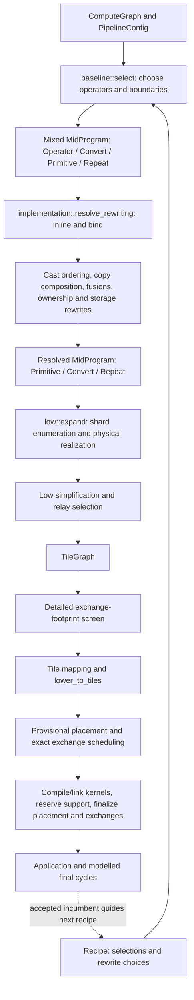
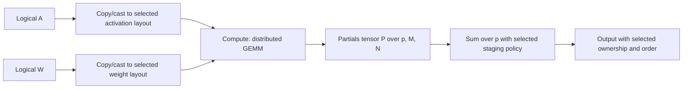
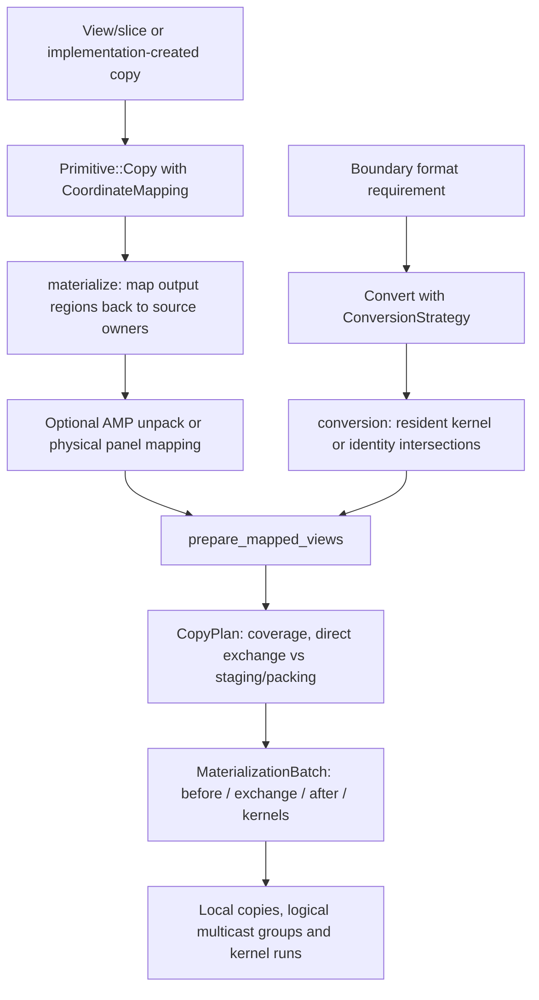

# Compiler data flow

Source review: 2026-09-14, `1501698`. This describes the current implementation.
[Structural proposal](COMPILER_STRUCTURE_PROPOSAL.md) describes the proposed changes.
Older experiment reports explain history, not the current pipeline.

## Start here

The public entry point is `build_package` in
[package.rs](../crates/ipu-codegen/src/package.rs). It compiles the runtime, then
calls `package/local::optimize` with a callback that builds a complete package.
Even with zero optimization steps, it constructs and validates a baseline.

The compiler has three principal program representations, but the boundaries
are less clean than their names suggest:

| Representation | What it contains | What remains undecided |
| --- | --- | --- |
| `ComputeGraph` | Shaped semantic operations, parameters, outputs and structured Repeat | Precision, distribution, kernels, movement, storage |
| `MidProgram` during selection | Chosen operator plans, optional cached mid implementations, conversions, deferred inputs, values with formats/ownership | Inlining, deferred movement, rewrites |
| `MidProgram` after resolution and rewrites | Whole-device `Compute`, mapped `Copy`, `Sum`, **remaining `Convert`**, and Repeat | Tile calls, physical copy recipes, some staging/alias decisions, routing, addresses |
| `TileGraph` | Shards, relative views, local copies, multicast source/recipient groups, kernel runs, structured control | Physical addresses, exact exchange instructions, linked symbols |
| `LowProgram` | An `Arc<TileGraph>` plus per-tile work indexes and Repeat bindings | Placement and executable construction |
| `ScheduledPlan` | Low program, provisional placement, encoded exchange phases, reusable scheduling choices | Support-memory reservations and their final placement effects |
| `Application` | Tile images, host bindings/protocol, debug/profile metadata | Loading and execution |

The two mid rows are **states of the same Rust type**, not separate checked
interfaces. `resolve` removes `Operator` but can leave `Convert`. Low rejects
an unresolved `Operator` at runtime. This is a significant source of ambiguity.

`TileGraph` and `LowProgram` share arenas, but their live operation lists can
diverge. `lower_to_tiles` projects the graph and then performs initialization
elimination on per-tile work only. The original graph still contains removed
calls. This matters because different downstream consumers use different lists;
see the low-work trace below.

## Production control flow

[baseline::lower](../crates/ipu-codegen/src/mid/baseline.rs) controls the mid
rewrite order. [local::optimize](../crates/ipu-codegen/src/package/local.rs)
keeps a fully validated incumbent. It generates recipes, rebuilds their mid
programs, screens using compact estimated cycles, and evaluates promising
candidates concurrently. It accepts the first improvement in shortlist order,
not the best of an exhaustively evaluated beam. Logical input homes are fixed
from the initial incumbent. A recipe is a search decision record; it is not
another executable representation.

The optional mapping search in
[package/placement.rs](../crates/ipu-codegen/src/package/placement.rs) proposes
one permutation over the entire active tile set. `map_tiles` changes every
shard and local work item together. This preserves their existing ownership
relationships; it cannot choose a different embedding for one operator's
outputs while leaving unrelated values alone. Mid's `tile_offset` and ownership
groups separately provide local rotations. The proposal records scoped owner-map
choices and makes the existing global proposal a joint recipe change; it does
not require searching independent maps immediately.

[validation::expand_and_screen](../crates/ipu-codegen/src/package/validation.rs)
expands each retained candidate and checks transfer geometry before scheduling.
The package callback then accounts for linked code, host support, exchange rows,
profiling and tensor placement. Final addresses can change scheduling, so the
provisional/final cycle is real. Cached ordering and widths are replayed and
validated; cached physical addresses are not assumed valid.

The reported final cycles still combine modelled kernel work with scheduled
exchange horizons. They are not hardware measurements. In addition to modelling
error, the low-work trace identifies an actual mismatch between their input and
emitted work.

## Trace 1: GEMM and its reduction

For `A[M,K] * W[K,N]`, a parallel plan partitions M, N and K. The K partitions
produce independent partial answers:

1. [Candidate generation](../crates/ipu-codegen/src/mid/candidates.rs) and
   [operator plans](../crates/ipu-codegen/src/mid/operator.rs) choose the grid,
   precision, orientation, kernel blocking, result layout and reduction staging.
   [ensure_format](../crates/ipu-codegen/src/mid/lowering.rs) prepares outer
   operand formats, possibly recording deferred movement.
2. [implementation/gemm.rs](../crates/ipu-codegen/src/mid/implementation/gemm.rs)
   builds a compact mid fragment. Parallel GEMM emits ordinary copies, a
   `Compute` with `ProductAxes`, a leading partials dimension, and `Sum`.
   Output-stationary GEMM instead exposes successive K-panel values and
   accumulating result versions. This is the owner of the distributed algorithm.
3. [implementation::resolve_region](../crates/ipu-codegen/src/mid/implementation/mod.rs)
   splices that fragment into the selected program, remaps value IDs, assigns
   ownership offsets, and inserts copies when compute operands need a different
   owner rotation. It can rebuild a fragment when deferred inputs change its
   actual input types.
4. [low/expand/primitive.rs](../crates/ipu-codegen/src/low/expand/primitive.rs)
   finds resident operand shards. `product_calls` enumerates local K/column
   blocks, chooses initialize/accumulate for those calls, clips logical work
   accounting, and selects the weight-load variant from the actual memory class.
   [expand/gemm.rs](../crates/ipu-codegen/src/low/expand/gemm.rs) further splits
   batch matrices for local execution. These loops do not search a new GEMM grid.
5. `prepare_sum` removes the independent-partials axis from alias views and
   groups matching coordinates. [expand/reduce.rs](../crates/ipu-codegen/src/low/expand/reduce.rs)
   intersects these groups with output ownership, chooses a seed, allocates
   bounded contributor buffers, and emits transfer/reduction stages. It bypasses
   seed or output copies when a compatible physical slice is usable directly.

The current `Sum` carries a distributed reduction axis and staging policy; the
local `ReduceSum` kernel implements individual stages. That distinction must
survive, but it does not justify placing sum outside `Compute`: the other mid
arithmetic also describes distributed work. The proposal puts sum under compute
while retaining the axis, result ownership and staging parameters.

However, its current implementation is narrower than the name: singleton partial
axis outside the final matrix axes, FP16 contributors/results, matching element
orders, and reduction pieces divisible by eight elements. These checks are split
between `prepare_sum` and `prepare_sum_partials`. They should be presented as
implementation capabilities, not silently treated as the semantics of summation.

## Trace 2: broadcast Add

Take `X[8,4,32] + B[1,4,32]`, with the output sharded over four column owners.
The semantic relation is `Y[b,r,c] = X[b,r,c] + B[0,r,c]`.

| Step | Current owner | Purpose |
| --- | --- | --- |
| Validate broadcasting and infer `[8,4,32]` | [graph.rs](../crates/ipu-codegen/src/graph.rs), `infer_shape`/`broadcast` | Define valid logical computation |
| Select output layout and compatible kernel | [mid/candidates.rs](../crates/ipu-codegen/src/mid/candidates.rs) | Choose distributed implementation |
| Project output ownership onto non-broadcast input axes | [implementation/mod.rs](../crates/ipu-codegen/src/mid/implementation/mod.rs), `pointwise_input_tiling` | Give each owner its corresponding `[1,4,8]` bias slice instead of a whole replicated parameter |
| Select resident shard and crop a broadcast view | [expand/primitive.rs](../crates/ipu-codegen/src/low/expand/primitive.rs), [pointwise.rs](../crates/ipu-codegen/src/low/expand/pointwise.rs) | Supply the local kernel with the needed coordinates |
| Validate supported broadcast shape and encode strides/counts | [kernel/abi.rs](../crates/ipu-codegen/src/kernel/abi.rs) | Match the actual kernel's address arithmetic |

These steps do different jobs; their existence is not automatically duplication.
The missing connection is a shared operand-indexing contract. Mid records mostly
empty `OperandWindow`s; low recognizes Add/BiasGeLU/AddLayerNorm by kernel name
and infers the relationship again. A new fused kernel can need another exception
in that dispatch. Broadcasting is also inferred for GEMM batch dimensions in a
separate helper.

Physical padding adds a second concern: equal-layout pointwise calls consume the
complete physical panel, whereas broadcasting a singleton axis must use the
logical shape even if storage is borrowed from a larger allocation.
`pointwise.rs` handles both. A logical broadcast map must not erase this distinction.

## Trace 3: mapped copy, unpacking and exchange

A view such as `[B,S,H*D] -> [B*H,S,D]` changes coordinate interpretation. It does
not by itself specify which bytes move or whether storage can be reused.

[materialize.rs](../crates/ipu-codegen/src/low/expand/materialize.rs) bridges
**logical coordinate mapping to shard-to-shard movement**. It maps output windows
back to sources, asks [CopyRegions](../crates/ipu-codegen/src/low/expand/ownership.rs)
for intersecting owners, recognizes reusable local storage, and tries physical
micro-panel movement. If the packed source cannot be handled that way, it can
insert an AMP-to-row-major unpack before mapping again.

[conversion.rs](../crates/ipu-codegen/src/low/expand/conversion.rs) contains both
a second entry path for `Convert` and the shared assembly used by mapped copies.
It constructs local kernels, stages unaligned transfers, groups multicast
recipients, and conditionally turns compatible local copies into receivers of an
existing multicast.

[CopyPlan::for_destination](../crates/ipu-codegen/src/low/copy.rs) computes
uncovered padding and chooses direct word transfers versus staging/packing using
estimated costs. This is **policy as well as geometry**. Meanwhile that same file
also implements relative copy descriptors and span coalescing.
[storage](../crates/ipu-codegen/src/storage.rs) owns layout-to-byte traversal.
The files are not organized along these responsibility boundaries.

The two entry paths do converge; they are not wholly duplicated engines. But
requiring them both means rewrites and costs must recognize both `Copy` and
`Convert`, and the selected conversion strategy does not fully describe the
physical route later chosen by `CopyPlan`.

There is additional control flow inside
[expand/emit.rs](../crates/ipu-codegen/src/low/expand/emit.rs): `append_kernel`
can split a GEMM into batch-matrix calls, while `append_exchange_phase` can move
intervening local copies and merge an earlier exchange through
[exchange_grouping.rs](../crates/ipu-codegen/src/low/expand/exchange_grouping.rs).
The latter checks read/write hazards and respects compute, Repeat and checkpoint
boundaries. These transformations currently happen during insertion, before the
explicit low simplification and relay passes.

[buffers.rs](../crates/ipu-codegen/src/low/expand/buffers.rs) also mediates borrowed
storage. `full_view` resolves a borrowed binding automatically, while other paths
must call `resolve_read_view` before using physical geometry. That caller-dependent
contract is separate from coordinate mapping and from following storage aliases
with signed byte displacements. The proposal makes this access boundary explicit
alongside movement and kernel binding.

## What each later representation is for

- `KernelRun` retains relative views, kernel specification and access requirements.
  It is not yet a fully checked executable call: ABI validation, specialization,
  scalar construction and some view-contiguity checks occur later in `kernel`.
- `LogicalExchange` stores one source with multiple recipient views. Physical
  addresses, message lengths, pairing and hazard ordering are resolved in
  [codegen/exchange.rs](../crates/ipu-codegen/src/exchange.rs). The encoding and
  timed-program builder live in [ipu-exchange](../crates/ipu-exchange/src/lib.rs).
- [place.rs](../crates/ipu-codegen/src/place.rs) derives lifetimes, aliases,
  access tails, element-separation constraints and addresses. Parameters remain
  resident across host invocations. `storage_group` in mid concerns ownership
  mapping; it does not itself mean two values alias the same allocation.
- Repeat remains structured throughout. Mid retains body and value sequences;
  low builds carried/invariant/iterated bindings; placement establishes sequence
  strides; tile emission uses advancing pointers, base relocation and patches.
  It is not implemented by compiling 27 unrelated bodies.
- [kernel::materialize_kernel_run](../crates/ipu-codegen/src/kernel/mod.rs)
  binds relative views to placed or Repeat-relative addresses.
  [tile.rs](../crates/ipu-codegen/src/tile.rs) builds `TileProgram`s;
  [codegen/lib.rs](../crates/ipu-codegen/src/lib.rs) emits supervisor instructions.
  The package builder assembles executable images and host-visible metadata.

## Trace 4: live low work and storage contracts

[lower_to_tiles](../crates/ipu-codegen/src/low/mod.rs) first projects `BlockRegion`
operations into tile work and Repeat instances.
[initialization.rs](../crates/ipu-codegen/src/low/initialization.rs) then removes
padding clears from the projected lists. The shared `TileGraph.body` is unchanged.

| Consumer | Execution description used |
| --- | --- |
| Final `scheduled_program_cycles` in [estimate/program.rs](../crates/ipu-codegen/src/estimate/program.rs), called by package construction | Original `BlockRegion` operations |
| [KernelBuildPlan](../crates/ipu-codegen/src/kernel/build.rs), runtime-symbol retention and tile emission | Filtered per-tile work, including Repeat bodies |
| Placement lifetimes and kernel access collection | Filtered `TileWorkRef` traversal |

A temporary test populated the graph body corresponding to the existing
initialization fixture and ran `lower_to_tiles`: two graph calls became one tile
call. Scheduled costing reported 1,402 cycles; removing the same dead call from
the graph before costing gave 1,390. The test was removed after this diagnostic.
It establishes disagreement about live work, not a large performance regression
or an inaccurate kernel inventory.

Several physical access contracts also have multiple owners:

- [expand/repeat.rs](../crates/ipu-codegen/src/low/expand/repeat.rs) preliminarily
  infers GEMM alignment and input tails to size iterated sequences.
  [low/call.rs](../crates/ipu-codegen/src/low/call.rs) declares those facts again.
  Placement recomputes stride from complete requirements; tile emission recovers
  it from consecutive addresses. The late placement calculation is necessary
  today and prevents treating the preliminary scan as authoritative.
- `KernelRun` and `KernelRequirements` distinguish a primary output from
  `additional_outputs`. `MemoryOperand::Output` refers only to the primary one,
  so the element-separation contract cannot name another result.
- [attention construction](../crates/ipu-codegen/src/mid/implementation/attention.rs)
  places FP32 statistics after probabilities inside a nominal F16/FP8 tensor.
  It crops probability copies to exclude the statistics; finite-padding reuse
  separately rejects attention kernels because their writes are not all F16.
- `tile::local_copy_call` selects copy helpers and arguments. Runtime inventory
  reuses that selection, but placement alignment and local-copy costing use
  separate rules instead of a common checked helper binding.

## Trace 5: exchange words back to relocation sites

The exchange builder emits instruction words. Later,
[exchange/relocation.rs](../crates/ipu-codegen/src/exchange/relocation.rs) invokes
`sender_address_instruction_groups` to scan those words for SEND and paired-send
restarts and recover offsets relative to each outgoing message. It matches the
groups back to scheduled send activities for Repeat relocation. Its base fallback
also invokes the diagnostic decoder to locate OUTGOING_BASE writes.

[ipu-exchange](../crates/ipu-exchange/src/lib.rs) separately implements
`normalized_exchange_address_words`, recognizing send and receive address fields
for cache replay and row sharing. `tile::layout_exchange_rows` normalizes each
row in both its counting and placement passes, then compares normalized and
original words to collect address-patch positions. These are production uses of
instruction interpretation, beyond the independent validation/diagnostic decoder.
The proposal retains relocation sites during encoding instead of discarding and
recovering them. The independent decoder remains useful for verification and SDK
captures.

## Costs and caches

Compact costing reads layouts and mid primitives; detailed costing reads tile
geometry/timelines; scheduled costing substitutes real exchange horizons. Sharing
kernel formulae does not make the first two equivalent. In particular, mid's
`Sum` scratch/traffic formula approximates choices subsequently made by physical
reduction lowering.

| Cache or retained analysis | Contents and key | Lifetime / owner |
| --- | --- | --- |
| `MemoizedCostModel.implementations` | `(OperatorPlan, input types, output type)` to compact mid fragment; ignores deferred-output marker | One `package/local::optimize` call; shared across candidate work |
| `MemoizedCostModel.rearrangements` | Shape, precision, strategy, source/destination layouts to coarse price | Same search; foldhash and `OnceLock` |
| `ExpansionCache.plans` | Destination type/extents and ordered source mappings to `CopyPlan`, including staging decisions | Same search in production; bounded at 32,768 entries |
| `ExpansionCache.copies` | Normalized view geometry, copy order, same-buffer flag to relative local-copy descriptors | Same search; separately bounded at 32,768 entries |
| `GeometryAnalysis` | Interned view traversals and source/recipient pair facts: bytes, fragments, receive spans | One candidate's expansion and footprint screen; also used to price tentative relays |
| `CopyRegions.targets` | Requested logical region to clipped source regions/replica owners | One source set during a copy or conversion; avoids repeating intersection work for replicas |
| `TileGraphBuilder.kernel_metadata` | Shared provenance/kernel/format access contracts, found by linear lookup | One expansion; operand views remain per call |
| Timeline `KernelCosts` | Interned call metadata plus physical widths to cycles | One timeline evaluation |
| `ExchangeScheduleCache` | Phase-indexed structure fingerprint, widths, order and normalized encoded rows; also owns the `stream_words` scheduling setting | Incumbent plus speculative candidate snapshots; physical replay is validated |
| ELF artifact cache | Source/includes, effective flags, target and tool identity to immutable compiled objects | On disk across builds |

[ExpansionCache](../crates/ipu-codegen/src/low/expand/cache.rs) uses custom
hash buckets with full equality checks; both its fingerprints and bucket maps
use the standard hasher. The implementation-fragment map and
[GeometryAnalysis](../crates/ipu-codegen/src/estimate/geometry.rs) also use
standard hash maps. These are not all caches of the same computation.

`borrowed_views` is different: it records storage substitutions made during
expansion. It is mutable lowering state, not a memoization cache, and cannot be
shared between candidates.

The exchange cache also invokes production algorithm selection using its stored
stream setting. This is policy ownership as well as caching. Separating policy
from cached results does not require evaluating more schedules; it makes the
caller-selected default explicit and requires replay compatibility with it.

The overlapping work is constructing, normalizing and matching byte geometry in
copy realization and geometry costing. The cached `CopyPlan` additionally
contains cost-dependent decisions, so it cannot simply become a global geometry
cache. Its current coefficients are fixed; a configurable target/policy would
need appropriate scoping or keying.

[Historical cache measurements](LOW_FRAGMENT_CACHE_2026_09_09.md) found a useful
MLP B2 improvement, marginal attention changes, and rejected broader fragment
caches. Those measurements have not been rerun for this review. Deleting caches
because their names overlap would discard evidence, not simplify the data flow.
