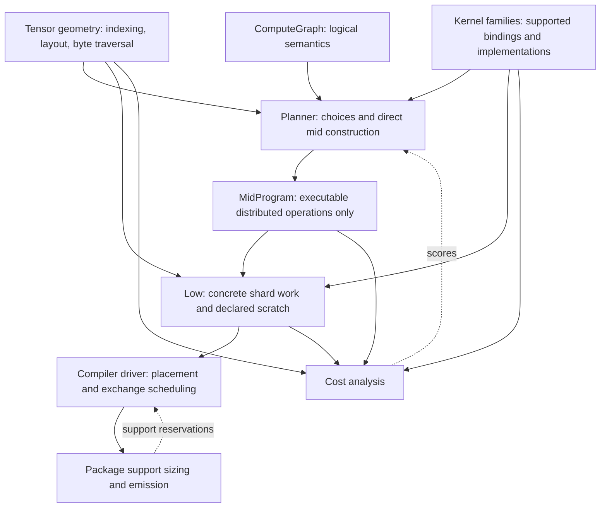

# Compiler structure proposal

2026-09-14. Design only; no compiler changes in this pass. Based on source at
`1501698`; revised after discussion of reduction, the two mid states, and source
comprehensibility. Read [current data flow](COMPILER_DATA_FLOW.md) for the concrete
paths behind this proposal. Proposed function names below specify responsibilities
and call direction; they are not existing APIs.

## Diagnosis

The principal problem is that the compiler repeatedly crosses the same conceptual
boundaries without naming them. It is difficult to know whether a function is
selecting an implementation, instantiating one, analysing geometry, mutating
storage, or encoding a call. Splitting files by operation name has not resolved
that problem.

The strongest examples are:

1. `MidProgram` is both a planner workspace and an executable distributed IR.
   `Operator`, `Convert`, `Primitive` and deferred-input state coexist. Every
   consumer must know which subset is legal at its point in the pipeline.
2. Movement has two mid representations and several intertwined realization
   responsibilities. `CopyPlan` sounds like geometry, but also chooses staging
   using hard-coded prices. Caches preserve that mixture.
3. A kernel call is assembled piecemeal: geometry and requirements in low,
   format/arity/shape validation in ABI code, specialization elsewhere, scalar
   values separately, and physical view checks during final materialization.
   Mid fusion capabilities describe only a subset of those contracts.
4. Architectural facts, runtime conventions and compiler policies are mixed
   across crates. Dependencies conceal ownership rather than enforce it.
5. Documentation describes a cleaner and older pipeline. Tests sometimes verify
   internal recipes rather than the external contract the recipes must satisfy.

These should be addressed as connected changes. A constants file, hasher switch,
renamed `materialize.rs`, or another collection of small helper extractions would
leave the main problem intact.

## Intended responsibility boundaries

Keep whole-device mid and tile-specific low. Do not introduce another program IR
or a new planning tier.



The solid edges describe consumed information, not a requirement to split every
box into a crate. Search owns decisions. Analyses consume descriptions. Backend
optimization may change physical realization, but must publish its resulting
scratch, dependencies and work before placement. A lowered program must not
contain unresolved requests for the planner to interpret.

### 1. Make mid an executable language

The lasting mid variants should be `Copy`, `Compute` and `Repeat`. Sum belongs
under `Compute`, alongside products and other arithmetic. All of them describe
distributed work. Values retain shape, precision, layout and owner mapping. A
mid operation never contains an optional implementation of itself or a deferred
conversion promise. With `Operator` and `Convert` gone, the outer `Primitive`
wrapper is unnecessary too.

There should be exactly one high-to-mid construction:

```text
semantic GEMM + chosen algorithm parameters + actual input bindings
    -> Copy A panels, Copy W panels, Compute::Product, Compute::Sum
```

For an output-stationary choice, the same builder instead emits bounded panels
and accumulating product operations. The distinction is decided while building
mid. `Compute::Product` contains the selected local blocking and contraction
axes; it is not a selected high-level GEMM waiting to choose one of those graphs.

`Recipe` is a map from semantic operation IDs to choice parameters, plus boundary
and rewrite choices. It has no executable edges, invented values or nested
implementations. The semantic graph supplies dependency order; the mid graph
supplies execution. Moving today's selected-operator graph to a private planner
type would retain the second layer and is explicitly not the proposed change.

Concrete effects:

- Remove `MidOperationKind::Operator` and `Convert` from executable mid.
- Replace `apply_selected_plan`'s construction of an `Operator` node with direct
  family emission. Retain necessary fragment splicing and ID remapping as mid
  construction utilities; they must not select algorithms or discover missing
  implementations.
- Express numerical casts as `Compute` and coordinate/layout movement as `Copy`.
  Preserve cast/pack fusion through supported kernel bindings. A conversion
  recipe can still contain several operations; it need not be one magic kernel.
- A panel-consuming implementation receives the actual source value and emits
  the slices it needs. Do not first invent a fully converted input with
  `DispatchSlices` and subsequently delete it. A consumer requiring the whole
  converted tensor receives an ordinary copy/cast result. Preserve these distinct
  realizations without a deferred materialization state in mid.
- Emit views as ordinary mapped copies. Consumer panel copies can compose with
  them; an externally observed or multiply used view keeps the materialization
  needed by its remaining users. Unsupported composition retains valid work.
  Remove deferred-output offers, claims and restoration of their suppressed costs.
- Remove duplicate recognition of casts/copies from rewrite helpers and estimators.
  They should inspect one executable form.
- Validate the resulting program at construction/rewrite boundaries. Costing
  must not be responsible for discovering whether an unresolved variant remains.

Family emission and its fragment cache belong to the planner. Remove
`CostModel::implementation`; costing consumes a valid mid fragment. A cached
fragment is itself a `MidProgram` with declared inputs and outputs. Binding it
must preserve its input contract, and its cache key must account for the boundary
facts that affect emitted work. There is no fragment-template language followed
by another expansion pass.

The migration must preserve existing explicit conversion choices. For example,
`LocalKernel`, direct retile and staging-before-pack must normalize to an
appropriate kernel/movement recipe or an explicit movement policy. Dropping
`Convert` and letting low infer whatever happens to work would not complete the
refactor. Whole-program ownership changes remain ordinary mid transformations:
they must update affected bindings/copies and costs, rather than depend on a later
operator-resolution pass to repair compute placement.

### 2. Give movement one path and separate geometry from policy

The common path should be:

1. Map requested destination coordinates to source coordinates.
2. Intersect those regions with the selected owner distributions.
3. Derive physical traversal, alignment and coverage facts.
4. Select among supported realizations using those facts and an explicit policy.
5. Append copies, exchange recipients, kernels, scratch and dependencies.

This is a function boundary within lowering, not five new program layers. Keep
symbolic traversals; do not expand to individual elements or bytes as the normal
representation.

`materialize.rs` currently does 1–2 plus reuse and unpack selection. `low/copy.rs`
combines 3–4 with local-copy coalescing. `conversion.rs` combines an alternative
entry path with 4–5. Rearrange these responsibilities while deleting the alternate
entry path:

- Preserve `CoordinateMapping`, `ViewGeometry`, `ByteTraversal` and `CopyRegions`
  where they describe distinct information. Put pure coordinate/layout/storage
  geometry behind a neutral tensor-geometry interface, not behind mid planning
  or a cost model.
- Make destination coverage and candidate physical spans pure results. They do
  not decide whether bandwidth is preferable to scratch.
- Keep one physical movement selector for direct panels, unpack/pack, source
  packing and compatible loopback. Give it the relevant cost policy explicitly.
  It returns the existing low work and scratch declarations.
- Remove `build_conversion`, `build_local_conversion` and
  `build_intersection_conversion` after their behavior is expressed by normalized
  mid operations. Reuse the mapped-copy path for identity mappings too.
- Keep phase grouping at the low schedule level, where concrete dependencies and
  tile overlap exist. Preserve the current independent-copy/reduction grouping
  behavior; do not require asynchronous execution across barriers.

Not every physical alternative belongs in mid. Local copy coalescing, safe
loopback selection, direct reduction slices and relay routing need shard facts.
They can remain explicit backend choices. By contrast, changing tensor precision,
replication, distributed algorithm, or the externally selected result layout
belongs in mid planning. Low must expose any extra staging before costing and
placement; it must not silently change those mid decisions.

This boundary lets compact costs remain approximate. It does not claim that mid
can predict exact exchange schedules, or require tile expansion for all search
candidates.

### 3. Describe operand indexing instead of recognizing kernel names

Broadcasting has three legitimate consumers: semantic validation, ownership
projection and local operand binding. They should share the logical indexing
relation, not repeat its interpretation independently.

For the existing broadcast Add example, the relation is simply
`(b,r,c) -> (0,r,c)` for the bias. Mid uses that relation to choose the input
ownership; low restricts it to a shard; the kernel family checks whether it can
consume that view with its implemented strides.

Make the operand relation explicit when constructing distributed compute.
Evolve `OperandWindow`/`ProductAxes` and the existing view machinery rather than
adding a general symbolic algebra framework. Cover the relations already needed:
identity, broadcast, selected windows and product axes. Keep composition partial
when a mapping cannot be represented; unsupported composition is not identity.

Physical panel coverage and padding remain separate from logical indexing.
Equal-layout pointwise kernels may intentionally process complete physical
panels, while singleton broadcast inputs refer to one logical coordinate. The
binding interface must retain both facts.

The endpoint is removal of Add/BiasGeLU/AddLayerNorm lists from generic low
operand selection. Adding a kernel with an existing indexing pattern should not
require teaching the generic expander its name.

### 4. Bind kernel calls through their owning families

Use the existing kernel-family modules to produce a checked address-independent
call description from selected views. Consolidate the result into `KernelRun`
and its shared metadata instead of retaining several parallel adapters.

A successful binding supplies:

- supported input/output formats and local indexing/stride interpretation;
- access extents, alignment, tails, allowed aliasing and element-separation needs;
- the specialization/build identity and typed scalar arguments;
- geometry used by the family cost formula.

Placement supplies base addresses afterwards. Final binding must still check
address-dependent restrictions, including bank relationships, representable
immediates and Repeat-relative pointers. It should not first discover ordinary
shape or view-contiguity incompatibility at that point.

Some information is cheap to derive and need not be stored in every call. The
requirement is one owner and one derivation, not caching every scalar field.
Preserve metadata interning and avoid multiplying per-tile storage.

Remove overlapping family decisions from `low/call.rs`, generic
`expand/primitive.rs`, `kernel/abi.rs`, `specialization.rs` and late
`materialize_kernel_run` as each family migrates. Keep family-specific code;
a large generic trait hierarchy would make the code harder to follow.

The same capabilities should serve fusion legality. The current
`output_capability` is a useful start, but its three supported families do not
constitute a complete kernel contract. Prices remain approximate; sharing legal
geometry does not turn them into cycle-exact instruction simulations.

### 5. Make reduction a compute family

Put sum in the same compute dispatch as products, pointwise work and normalization.
Its output layout, partials axis and selected staging policy remain explicit.
Do not replace the current distinction with `Compute::{Local, Collective}`:
products and pointwise work are distributed too.

The compute interface must describe operand indexing and selected execution for
each family, rather than assume every computation is one kernel invocation per
output shard. Product expansion enumerates its contraction blocks; sum expansion
enumerates contributors and bounded stages. Both construct low work directly.
Neither returns another mid graph for a later pass to resolve.

This also means separating fields currently conflated in `TileKernelSpec`:
distributed compute parameters belong in mid, and a particular callable ABI is
selected when binding local work. Reuse the existing family-specific parameter
records where possible; do not keep a complete copy of both old and new enums
joined by an adapter table.

Separate three responsibilities currently spread through its implementation:

- the planner selects staging/result ownership; mid validates the resulting
  mathematical reduction and operand relationships;
- backend reduction construction determines contributor groups, seed/staging
  buffers and direct physical output opportunities;
- the selected reduction kernel validates its precision/layout/access contract.

Move the current FP16/packed-kernel restrictions to the implementation capability
boundary. Do not make arbitrary-axis or other-precision summation appear supported
until an implementation exists. Conversely, do not define summation itself in
terms of today's eight-element kernel width.

Keep shared compact stage-count arithmetic where it is genuinely the same.
Mid's conservative scratch estimate and low's concrete buffer allocation are
not identical computations and should not be forced through tile expansion to
eliminate a few separate expressions.

## Concrete compiler control flow

There are two algorithms to make visible: searching among whole-program
candidates, and compiling one candidate with placement feedback. Put their two
entry routines together in `compile.rs`. Requiring literally one function would
combine a search loop with hundreds of lines of image construction. Merely moving
`local::optimize` and its finalization callback to that file would leave the
current problem unchanged.

### Driver, planner and package interfaces

| Owner | Entry and result | Decisions it owns |
| --- | --- | --- |
| `planner` | `build_candidate(graph, bindings, recipe) -> Candidate` | Choose unspecified algorithms; directly build and rewrite valid mid; report compact cost, normalized recipe and alternatives |
| `planner` | `propose(graph, candidate) -> recipes` | Neighborhood enumeration, including joint producer/consumer choices; no package evaluation |
| `compile` | `build_package(graph, config) -> CompiledPackage` | Baseline, shortlist, attempt budget, ordered concurrent evaluation, acceptance, checkpointing |
| `compile` | `evaluate_candidate(mid, mapping, config, caches) -> built result` | Expansion, screening, provisional and final allocation/scheduling, bounded placement improvement, complete feasibility |
| `package` | Support sizing/reservation and final emission functions | Linked images, host/tile program sizes, support ranges, address binding, capacity checks, serialization; no tensor search or exchange scheduling |
| `estimate` | Mid, low and scheduled cost queries | Analysis of their supplied representation; no implementation construction |

`Candidate` replaces the present `Baseline` record; it is a valid mid program
with search metadata, not a new IR. `OperatorPlan` becomes planner choice data
without deferred execution fields. Existing candidate-generation helpers move
out of `mid`, along with baseline construction, recipes and checkpoint schema.
Mid retains executable data structures, construction/composition and rewrites.
Search selects rewrite options; the rewrites themselves consume and return mid.
`PipelineConfig` also moves out of mid beside compiler/planner configuration;
loading checkpoints and choosing exchange budgets are not IR responsibilities.
Keep the public configuration API stable where practical rather than inventing
a configuration wrapper for every helper.

The outer routine should read in this order:

```text
compile runtime; create shared fragment/geometry caches
load recipe, input bindings, visited choices and attempt count
build baseline/resumed candidate as executable mid
evaluate_candidate(baseline); fail the build if no feasible incumbent exists
fix logical input homes and save the accepted checkpoint

if the existing tile-mapping proposal is due:
    propose mapping; evaluate_candidate with it
    replace the incumbent only on a feasible scheduled-cost improvement
    save checkpoint

while attempt budget remains:
    propose recipes from the accepted candidate
    build valid mid candidates and compute compact costs concurrently
    discard visited/invalid/non-improving candidates; deduplicate identical mid
    sort and truncate using the current shortlist and budget rules
    evaluate candidates concurrently, each with its own schedule-cache snapshot
    choose the first feasible improvement in shortlist order
    record completed prefix; replace the whole incumbent or retain it
    save checkpoint; stop when the existing stopping rule applies

return the accepted package and its diagnostics
```

This preserves current ordered `find_first` behavior, cancellation and recipe
alias bookkeeping. It does not silently introduce a beam search or accept the
first worker to finish. Rayon can still parallelize candidate construction and
their internal work. Caches of immutable fragments/geometry are shared;
speculative schedules remain separate and only the winner's cache is promoted.

The planner neither invokes an evaluator nor receives a finalization callback.
The driver directly calls `evaluate_candidate` and sees its result. A failed
challenger cannot replace the incumbent's program, package or schedule cache.
Checkpoint I/O stores choices and progress; it does not secretly launch search.

### One candidate, including the real feedback

`evaluate_candidate` should show this sequence directly. Each line crosses a
specific, named boundary; there is no `validate` call that later turns out to
compile and package the program through a callback.

```text
expand mid into low work; share geometry analysis with the footprint screen
reject excessive transfer geometry before expensive scheduling
apply the candidate's tile mapping; construct per-tile work indexes
place tensors provisionally
schedule exchanges against provisional addresses
compile selected kernels and link runtime/kernel objects for sizing
size and reserve linked code, host/tile code, rows, descriptors and profile data
place tensors and auxiliary allocations in the resulting available ranges
replay/rebuild exchanges against those final addresses

score the existing alternative address placements cheaply
if there is a promising alternative:
    schedule only the best alternative, with a private cache snapshot
    keep it only if its schedules improve and fit the reserved row capacity

calculate scheduled cost using the retained final exchanges
bind addresses and emit the package; check all measured capacities
return final low work, placement, exchanges, package, cost and accepted cache
```

The provisional schedule is needed to measure row storage and generated control
code. Those reservations change available tensor addresses. Final addresses can
change row sharing and hazards, so schedule replay must be validated. These two
passes remain visible; they are not a convergence loop or a license to retry with
ever larger reservations. Preserve the current reserved-capacity checks and
reject a candidate whose final rows/code do not fit.

The current `placement::improve_exchange_placement` hides an allocator loop and a
scheduler invocation. Split its reusable cheap conflict-scoring/proposal work
from evaluation. Put the single detailed alternative evaluation and acceptance
alongside the initial final placement in `evaluate_candidate`. Otherwise the
supposedly explicit driver would still conceal one of its feedback paths.

Support sizing is a real subprocedure, not a `finalize` synonym. It owns a
connected calculation of code/descriptor/row reservations from the low program,
linked objects and provisional exchanges. It cannot change tensor ownership,
invoke tensor placement, or schedule exchanges. Final emission consumes the
retained placement and exchanges and checks the reservations. The same emitters
can continue to be used for sizing and emission; separate passes are not a reason
to duplicate the encoding logic.

The provisional placement and phases stay local to evaluation. Consolidate
`ScheduledPlan` and the internal `BuiltApplication` result instead of returning a
provisional placement in one object and a final placement in another. The returned
record holds one final placement and phase set with the artifact they produced.
Diagnostic and mapping consumers use explicitly selected data; a consumer that
still needs provisional information must name that need. This ownership change
must not accidentally alter the mapping heuristic without measuring it.

## Connected construction, with concrete source owners

The following boundaries are the implementation plan, rather than a request to
add introductions to the existing collection of helpers.

### Graph and GEMM construction

`planner::build_candidate` owns a readable topological graph walk. For each
semantic operation it looks up actual inputs, obtains choices from its family,
constructs executable fragments for the choices it needs to cost, selects one,
and commits it. It applies an explicit output-boundary copy when required.
Repeat recursively uses that same construction with carried, invariant and
sequence bindings; it is not passed through an operator-resolution layer.

The family emission boundary is concrete: an operation, a choice, actual input
values and required result formats go in; executable mid and its result values
come out. It does not receive a cost model or select another choice internally.
The graph builder owns enumeration, emission and ranking. After composition and
the selected rewrites, it explicitly calls estimate analysis to refresh costs.
This separates choosing, constructing and pricing without scattering the graph
walk across those owners.

Use one fragment-construction routine for both candidate costing and insertion.
Currently `baseline::region` has a capacity-specific fragment-building branch,
a different non-capacity cost path, and then `apply_selected_plan` constructs the
selected form again. Keep different ranking policies and useful analytical
shortcuts, but do not maintain separate recipes for what work each choice means.
Live-through inputs and persistent sequence multiplicity are costing context;
they must accompany the same executable fragment when measuring its peak.

Within `planner/gemm.rs`, the family constructor reads as:

1. Validate the chosen orientation, grid, precision and result requirements
   against the actual inputs.
2. For parallel reduction, derive left/right resident distributions and the
   explicit partials tensor; emit their copies/casts, product, then sum.
3. For output-stationary execution, derive resident panels and emit the bounded
   panel/product sequence, or use already resident compatible inputs.
4. Return the produced mid value(s).

The distribution-specific steps belong together in that family, including the
relationship between grid strides and partials. Shared builder operations such
as `copy`, `cast`, `compute` and fragment insertion are meaningful reusable
concepts. A separate helper for each successive local calculation is not needed.
Ownership rebinding is explicit at construction/rewrite time; insertion does not
infer a GEMM-specific anchor and then inject surprise copies.

`low/expand/gemm.rs` owns the connected instantiation of an already selected
product: intersect resident operands, enumerate local contraction blocks,
bind calls through `kernel/gemm`, and append low work. Move `product_calls` and
its GEMM-specific branches there from generic `expand/primitive.rs`. It does not
choose the parallel-reduction versus output-stationary algorithm again.
`low/expand/reduce.rs` similarly owns contributor grouping through emission of
the selected sum stages, including the present `prepare_sum` entry logic.

### Movement construction

Replace `materialize.rs` and the shared realization portion of `conversion.rs`
with one `low/expand/movement.rs` owner. Delete the legacy conversion entry path.
Its main procedure maps a copy to source/destination regions, inspects their
physical geometry, selects realizations, then emits the resulting batch. Keep
that procedure and its policy beside each other. Do not retain a sequence of
generic `prepare`/`build`/`materialize` helpers spread across those old files.

Reusable helpers remain for coordinate composition, ownership intersections,
byte traversal and coverage. Their signatures expose the actual objects they
operate on; they do not take the entire planner or low builder to compute a pure
fact. `CopyRegions` remains an ownership query; it must not choose a packing
kernel. A relative local-copy descriptor remains low data; it must not price a
distributed tensor movement. The batch of pre-exchange work, recipients and
post-exchange work is local assembly state that gets consumed, not another
retained program language.

### Broadcast and kernel binding

For Add, the semantic/indexing code provides the broadcast relation. The
pointwise family constructor projects output ownership through that relation
and emits required input copies. Generic low operand binding restricts the
recorded relation to a shard. `kernel/pointwise` validates the local stride/format
contract and derives ABI scalars, specialization and access requirements.
That trace replaces the kernel-name exceptions in `expand/primitive.rs` and the
separate broadcast reinterpretation in `pointwise.rs`.

Family binding must own the corresponding decisions now spread through
`low/call.rs`, `kernel/abi.rs`, specialization and late materialization. Generic
dispatch delegates to that owner. Shared instruction encoders and view geometry
remain shared; moving their code into every family would introduce duplication.
Adding an Add-like fused kernel with an existing indexing relation should require
its semantic/fusion rule and family implementation, without editing a low
broadcast dispatch list or a second ABI-selection table.

### What must be apparent from the source

| Reader's question | Where the answer must be visible |
| --- | --- |
| Why was this candidate accepted or rejected? | Driver shortlist/evaluation/acceptance in `compile.rs`, with named failure stages |
| What does this high GEMM become? | Its family constructor in `planner/gemm.rs`, showing copies, product and sum in order |
| Why was this copy packed or staged? | The single movement selector, with facts and policy as explicit inputs |
| Why does this operand broadcast and which coordinates are read? | Recorded indexing relation, followed by its restriction to a shard |
| Why does this kernel require a tail, alignment or separate element? | Its family binding contract, reused by placement and call emission |
| Which pass may alter ownership, aliasing or phase grouping? | Named mid rewrite or low transformation called by the relevant entry routine |

Module introductions should describe their inputs, guarantees and decisions in
those terms. Comments beside an algorithm should explain constraints such as
partial independence, padding coverage or why final scheduling is repeated.
Remove stale role descriptions; comments that merely expand a helper's name do
not satisfy this requirement.

Use explicit internal imports from the owning module. Public compatibility
re-exports can remain, but internal `use super::*` and root imports must not hide
whether a function belongs to planning, geometry or the backend. Keep single-use
sequential steps in their procedure unless extraction exposes a substantial,
independently understandable subalgorithm. There is no target file-length limit
or requirement to make a file for every box in the diagram.

Completion is a source-reading exercise as well as a test result: follow the
GEMM, broadcast and movement examples from the entry routines without consulting
this document. If their sequencing still depends on callbacks, implicit builder
mutations in unrelated files, or representation-dependent accessor fallbacks,
the refactor is unfinished.

## Hardware and runtime ownership

The constants issue is substantial, but one undifferentiated constants file
would just relocate it.

| Current examples | Actual meaning | Proposed owner |
| --- | --- | --- |
| `ipu-package`: SRAM base/size, element size, executable-region limit, interleave geometry | IPU21 architectural facts | A small dependency-leaf `ipu-target::ipu21::memory` |
| `ipu-driver`: a second `TILE_MEMORY_SIZE` | Duplicate architectural fact | Import the same target definition |
| `ipu-exchange::Topology::c600`, logical mapping and physical pairing rules | C600 tile inventory/mapping and IPU21 fabric facts | Target modules, separated from multicast program construction |
| `INCOMING_*`, `OUTGOING_BASE`, numeric `0xa7` uses across codegen/exchange | Register identities | `ipu-target::ipu21::registers` |
| Generic `encode_setzi_m`, load/store/branch encoders inside `ipu-exchange` | Supervisor instruction encoding, used outside exchanges | `ipu-target::ipu21::instruction` |
| Secondary-loader frame sizes, loadable limit, startup handoff mark | Loader/protocol ABI, not SRAM capacity | An explicit loader-ABI module shared by package validation and driver; initially within `ipu-package` |
| `EXCHANGE_WINDOW_BASE`, runtime state/stack reservations and the commonly used operand window | Our runtime placement conventions/defaults | Codegen runtime-layout configuration and reservation construction |
| Three-element support reservation, cast/copy launch prices, fragment-control estimates | Compiler heuristic/calibration policy | Planner budget/cost configuration |

`Topology` currently mixes a logical-to-physical mapping with methods that build
encoded multicast plans. Split those responsibilities: the target supplies
mapping/fabric facts; `ipu-exchange` consumes them to construct timed programs.
Do not move the entire scheduler into the target crate.

Package validation may consume target facts, but the package format should not
be the source of architectural truth. Codegen currently depends on the driver
for loader constants and the startup mark; putting those in the explicit shared
ABI removes that dependency without making the driver a compiler utility crate.

Keep policies such as preferring standard memory explicit. Never substitute
address ordering or today's region placement for policy. A known hardware fact
and an experimentally calibrated timing assumption should also be distinguishable
in the source.

Only one new leaf crate is proposed here. The other boundaries can be ordinary
modules. Rust/device-assembly constants that must agree need a shared ABI input
or generated include; two synchronized-looking copies are not a source of truth.

## Caching after responsibilities are separated

Retain separate lifetimes for search reuse, per-candidate analysis and on-disk
kernel artifacts. A universal cache would mix incompatible invalidation rules.

The concrete consolidation opportunity is a shared geometry facility for
normalized views, traversals and pair facts, usable by local-copy generation,
copy preparation and detailed exchange costing. It replaces repeated geometry
construction in `ExpansionCache` and `GeometryAnalysis`; it does not conflate
local-copy descriptors with exchange schedules.

Move cost-dependent selection out of cached geometry. If retaining selection
results is still worthwhile, keep them scoped to the immutable policy of one
build or key that policy explicitly. Preserve exact equality, same-buffer
ordering behavior, padding, element order and view bounds in keys.

Use foldhash for internal geometry and implementation maps/fingerprints after
these keys have one definition. Avoid the current hand-built sequence of hashing
borrowed plan fields, separately comparing those fields, then separately owning
them unless measurements justify that complexity. A borrowed-key lookup can be
kept without duplicating the meaning of a key. Do not change persistent ELF
content hashes to a fast non-cryptographic map hasher.

First measure disabled/cold/warm behavior on the same representative builds used
by the existing expansion benchmark, especially MLP B2. Track retained bytes as
well as entry count and hit rate. The old 32,768-entry bounds are not memory
budgets. A shared pool may save repeated traversals but retain more live data;
that tradeoff needs measurement before removing the old cache.

## Tests that allow structural improvement

An expected output is useful when it is independently justified. These examples
illustrate which tests should change with the architecture:

| Current test | Assessment | Replacement or retained contract |
| --- | --- | --- |
| `randomized_gelu_abis_select_supported_layout_paths` | Randomizes layouts, then asserts the same symbol, pointer count and scalar enum; little independent evidence | A small ABI smoke case if needed; execute representative supported layouts and compare numerical results/coverage |
| `randomized_gemm_plans_compile_and_select_scheduled_row_specializations` | Does not invoke a compiler despite its name; fixes object count, flags and symbol naming | Retain coverage that emitted calls resolve; use an actual build/link fixture for closure and row specialization, without freezing compilation-unit counts |
| `worker_stack_support_follows_cpp_recipes` | Restates the source-selection table | Verify linked C++ worker dependencies and stack reservations; permit implementation to switch between C++ and assembly |
| `unsupported_kernel_abis_fail_at_lookup` | Some cases assert today's missing features, so adding a valid implementation breaks them | Test inconsistent precision/arity/layout contracts and supported/unsupported declarations, not perpetual absence of future kernels |
| Mapping-semantics interpreter and randomized byte-coverage tests | Check an independent coordinate/coverage contract | Keep and extend to packed orders, aliases, partial windows and padding; the current randomized layout generator is mostly row-major/linear |
| Cache-disabled/cold/warm complete-graph comparisons | Valid optimization-equivalence test | Keep; it is allowed to compare implementation outputs because equivalence is the property being tested |
| Exchange instruction fixtures and SDK-compatible rows | Literal encodings are part of the hardware contract | Keep independent known encodings, decode/execute checks and hazard tests |

A test checking that emitted symbols appear in the same generated inventory
protects wiring, but cannot prove the symbol exists in the object or computes
the right thing. Keep a small wiring test; do not count it as hardware correctness.
Use existing standalone hardware fixtures rather than inventing another kernel
harness. Numerical tests should use appropriate tolerances and the established
full-model cosine requirement, not bit-exact agreement with arbitrary historical
kernels.

## Migration and completion criteria

First make the two driver routines explicit, preserving the existing search
policy and evaluation order. Then replace selected-operator construction with
direct executable mid construction, including boundary conversions and Repeat.
Complete the single movement path and family binding as connected follow-through.
Moving constants can be a separate contained commit, but is not the main
architectural result.

| Slice | Required endpoint | Code that should disappear or lose responsibility |
| --- | --- | --- |
| Compiler driver | One visible search loop and one visible candidate evaluation; package code consumes final placements/schedules | `local::optimize` finalization callback, `validate<T>` indirection, nested scheduling in package placement improvement, duplicated provisional/final result ownership |
| Target/ABI ownership | One definition per hardware fact or shared protocol constant; compiler no longer imports driver for constants | Duplicate SRAM/register constants; generic instruction encoders and tile mapping misplaced in exchange; runtime policy mixed into architectural definitions |
| Direct mid construction | Graph plus recipe emits only Copy, Compute and Repeat; both candidate costing and insertion use the same emitter | `Operator`, `Convert`, `Primitive` wrapper, `resolve_region`, `CostModel::implementation`, deferred offers/claims/cost restoration, dual cast/copy recognition |
| Movement/geometry consolidation | One mapping-to-movement path, pure reusable facts, explicit physical selection | Independent identity-intersection path and repeated geometry-key/traversal construction; custom cache policy where no longer justified |
| Compute and kernel binding | Sum is a compute family; existing indexing patterns reused without generic kernel-name exceptions; static call legality checked before placement | Separate top-level Sum, product/reduction-specific orchestration in generic expansion, scattered broadcast inference and overlapping call/specialization/argument derivation |
| Source comprehensibility | The named entry routines show sequence and decisions; family/movement procedures own their construction end to end | Implicit cross-module builder mutations, single-use step scattering, broad internal re-exports that mask ownership, stale module explanations |

Perform each slice as runnable commits and remove its old path before declaring
it complete. Do not stop after relocating selected-operator nodes into a private
type or after renaming the movement files. Retain the necessary
placement/scheduling feedback; package support really can change available SRAM
and exchange behavior. Do not add a new retry or planning system.

For each changed path, verify semantic mappings and numerical contracts, coverage
and alias safety, Repeat residency and sequence behavior, and successful package
construction for representative saved SigLIP/PE plans. Compare expansion/search
time, peak host memory, per-tile memory and on-device cycles where the path
changes. One deterministic hardware run per distinct package is enough.

Track non-test source size and the number of places a new operation/indexing
pattern must modify. A refactor that only moves files or adds adapters without
removing the previous paths has not met the objective. No credible percentage
reduction can be promised from this source review alone.

The design deliberately leaves the search algorithm and supported distributed
layouts intact. It provides explicit places to improve them later without
reconstructing the compiler's meaning from helper names and call history.
