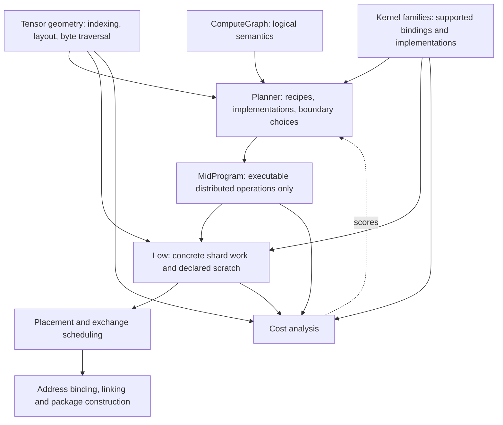

# Compiler structure proposal

2026-09-14. Design only; no compiler changes in this pass. Based on source at
`1501698`. Read [current data flow](COMPILER_DATA_FLOW.md) for the concrete paths
behind this proposal.

## Diagnosis

The principal problem is that the compiler repeatedly crosses the same conceptual
boundaries without naming them. It is difficult to know whether a function is
selecting an implementation, instantiating one, analysing geometry, mutating
storage, or encoding a call. Splitting files by operation name has not resolved
that problem.

The strongest examples are:

1. `MidProgram` is both a planner workspace and an executable distributed IR.
   `Operator`, `Convert`, `Primitive` and deferred-input state coexist. Every
   consumer must know which subset is legal at its point in the pipeline.
2. Movement has two mid representations and several intertwined realization
   responsibilities. `CopyPlan` sounds like geometry, but also chooses staging
   using hard-coded prices. Caches preserve that mixture.
3. A kernel call is assembled piecemeal: geometry and requirements in low,
   format/arity/shape validation in ABI code, specialization elsewhere, scalar
   values separately, and physical view checks during final materialization.
   Mid fusion capabilities describe only a subset of those contracts.
4. Architectural facts, runtime conventions and compiler policies are mixed
   across crates. Dependencies conceal ownership rather than enforce it.
5. Documentation describes a cleaner and older pipeline. Tests sometimes verify
   internal recipes rather than the external contract the recipes must satisfy.

These should be addressed as connected changes. A constants file, hasher switch,
renamed `materialize.rs`, or another collection of small helper extractions would
leave the main problem intact.

## Intended responsibility boundaries

Keep whole-device mid and tile-specific low. Do not introduce another program IR
or a new planning tier.

The solid edges describe consumed information, not a requirement to split every
box into a crate. Search owns decisions. Analyses consume descriptions. Backend
optimization may change physical realization, but must publish its resulting
scratch, dependencies and work before placement. A lowered program must not
contain unresolved requests for the planner to interpret.

### 1. Make mid an executable language

The lasting mid variants should be distributed copy, distributed compute,
distributed reduction and Repeat. Values retain shape, precision, layout and
owner mapping. A mid operation never contains an optional implementation of
itself or a deferred conversion promise.

Use the existing `Recipe` and semantic graph for unresolved selections. Keep
operator alternatives, boundary demands and deferred bindings private to the
planner. Instantiate valid mid fragments into one program once those bindings
are known. This replaces mixed mid state; it should not create a second graph
mirroring every semantic node merely to move the same ambiguity elsewhere.

Concrete effects:

- Remove `MidOperationKind::Operator` and `Convert` from executable mid.
- Move selected-operator/deferred-binding records out of mid operations. The
  existing fragment splicing and ID-remapping logic remains necessary, owned by
  planner composition.
- Express numerical casts as `Compute` and coordinate/layout movement as `Copy`.
  Preserve cast/pack fusion through supported kernel bindings. A conversion
  recipe can still contain several operations; it need not be one magic kernel.
- Resolve `DispatchSlices` before constructing the executable mid value. Preserve
  consumer-sized copies and deferred-view optimizations, rather than materializing
  everything early to make the types easier.
- Remove duplicate recognition of casts/copies from rewrite helpers and estimators.
  They should inspect one executable form.
- Validate the resulting program at construction/rewrite boundaries. Costing
  must not be responsible for discovering whether an unresolved variant remains.

`CostModel::implementation` should move to the planner's implementation provider.
A cost model can price a valid mid fragment without also owning the factory that
constructs it. Keep the implementation cache beside that provider. This removes
an actual responsibility cycle rather than hiding it behind another wrapper.

The migration must preserve existing explicit conversion choices. For example,
`LocalKernel`, direct retile and staging-before-pack must normalize to an
appropriate kernel/movement recipe or an explicit movement policy. Dropping
`Convert` and letting low infer whatever happens to work would not complete the
refactor.

### 2. Give movement one path and separate geometry from policy

The common path should be:

1. Map requested destination coordinates to source coordinates.
2. Intersect those regions with the selected owner distributions.
3. Derive physical traversal, alignment and coverage facts.
4. Select among supported realizations using those facts and an explicit policy.
5. Append copies, exchange recipients, kernels, scratch and dependencies.

This is a function boundary within lowering, not five new program layers. Keep
symbolic traversals; do not expand to individual elements or bytes as the normal
representation.

`materialize.rs` currently does 1–2 plus reuse and unpack selection. `low/copy.rs`
combines 3–4 with local-copy coalescing. `conversion.rs` combines an alternative
entry path with 4–5. Rearrange these responsibilities while deleting the alternate
entry path:

- Preserve `CoordinateMapping`, `ViewGeometry`, `ByteTraversal` and `CopyRegions`
  where they describe distinct information. Put pure coordinate/layout/storage
  geometry behind a neutral tensor-geometry interface, not behind mid planning
  or a cost model.
- Make destination coverage and candidate physical spans pure results. They do
  not decide whether bandwidth is preferable to scratch.
- Keep one physical movement selector for direct panels, unpack/pack, source
  packing and compatible loopback. Give it the relevant cost policy explicitly.
  It returns the existing low work and scratch declarations.
- Remove `build_conversion`, `build_local_conversion` and
  `build_intersection_conversion` after their behavior is expressed by normalized
  mid operations. Reuse the mapped-copy path for identity mappings too.
- Keep phase grouping at the low schedule level, where concrete dependencies and
  tile overlap exist. Preserve the current independent-copy/reduction grouping
  behavior; do not require asynchronous execution across barriers.

Not every physical alternative belongs in mid. Local copy coalescing, safe
loopback selection, direct reduction slices and relay routing need shard facts.
They can remain explicit backend choices. By contrast, changing tensor precision,
replication, distributed algorithm, or the externally selected result layout
belongs in mid planning. Low must expose any extra staging before costing and
placement; it must not silently change those mid decisions.

This boundary lets compact costs remain approximate. It does not claim that mid
can predict exact exchange schedules, or require tile expansion for all search
candidates.

### 3. Describe operand indexing instead of recognizing kernel names

Broadcasting has three legitimate consumers: semantic validation, ownership
projection and local operand binding. They should share the logical indexing
relation, not repeat its interpretation independently.

For the existing broadcast Add example, the relation is simply
`(b,r,c) -> (0,r,c)` for the bias. Mid uses that relation to choose the input
ownership; low restricts it to a shard; the kernel family checks whether it can
consume that view with its implemented strides.

Make the operand relation explicit when constructing distributed compute.
Evolve `OperandWindow`/`ProductAxes` and the existing view machinery rather than
adding a general symbolic algebra framework. Cover the relations already needed:
identity, broadcast, selected windows and product axes. Keep composition partial
when a mapping cannot be represented; unsupported composition is not identity.

Physical panel coverage and padding remain separate from logical indexing.
Equal-layout pointwise kernels may intentionally process complete physical
panels, while singleton broadcast inputs refer to one logical coordinate. The
binding interface must retain both facts.

The endpoint is removal of Add/BiasGeLU/AddLayerNorm lists from generic low
operand selection. Adding a kernel with an existing indexing pattern should not
require teaching the generic expander its name.

### 4. Bind kernel calls through their owning families

Use the existing kernel-family modules to produce a checked address-independent
call description from selected views. Consolidate the result into `KernelRun`
and its shared metadata instead of retaining several parallel adapters.

A successful binding supplies:

- supported input/output formats and local indexing/stride interpretation;
- access extents, alignment, tails, allowed aliasing and element-separation needs;
- the specialization/build identity and typed scalar arguments;
- geometry used by the family cost formula.

Placement supplies base addresses afterwards. Final binding must still check
address-dependent restrictions, including bank relationships, representable
immediates and Repeat-relative pointers. It should not first discover ordinary
shape or view-contiguity incompatibility at that point.

Some information is cheap to derive and need not be stored in every call. The
requirement is one owner and one derivation, not caching every scalar field.
Preserve metadata interning and avoid multiplying per-tile storage.

Remove overlapping family decisions from `low/call.rs`, generic
`expand/primitive.rs`, `kernel/abi.rs`, `specialization.rs` and late
`materialize_kernel_run` as each family migrates. Keep family-specific code;
a large generic trait hierarchy would make the code harder to follow.

The same capabilities should serve fusion legality. The current
`output_capability` is a useful start, but its three supported families do not
constitute a complete kernel contract. Prices remain approximate; sharing legal
geometry does not turn them into cycle-exact instruction simulations.

### 5. Retain distributed reduction explicitly

Keep `Sum` as a distributed collective. Its output layout, partials axis and
staging policy carry useful information that a local kernel call cannot express.
There is no benefit to an otherwise unused generic reduction enum merely to
rename this variant.

Separate three responsibilities currently spread through its implementation:

- mid validates the mathematical reduction and selects staging/result ownership;
- backend reduction construction determines contributor groups, seed/staging
  buffers and direct physical output opportunities;
- the selected reduction kernel validates its precision/layout/access contract.

Move the current FP16/packed-kernel restrictions to the implementation capability
boundary. Do not make arbitrary-axis or other-precision summation appear supported
until an implementation exists. Conversely, do not define summation itself in
terms of today's eight-element kernel width.

Keep shared compact stage-count arithmetic where it is genuinely the same.
Mid's conservative scratch estimate and low's concrete buffer allocation are
not identical computations and should not be forced through tile expansion to
eliminate a few separate expressions.

## Hardware and runtime ownership

The constants issue is substantial, but one undifferentiated constants file
would just relocate it.

| Current examples | Actual meaning | Proposed owner |
| --- | --- | --- |
| `ipu-package`: SRAM base/size, element size, executable-region limit, interleave geometry | IPU21 architectural facts | A small dependency-leaf `ipu-target::ipu21::memory` |
| `ipu-driver`: a second `TILE_MEMORY_SIZE` | Duplicate architectural fact | Import the same target definition |
| `ipu-exchange::Topology::c600`, logical mapping and physical pairing rules | C600 tile inventory/mapping and IPU21 fabric facts | Target modules, separated from multicast program construction |
| `INCOMING_*`, `OUTGOING_BASE`, numeric `0xa7` uses across codegen/exchange | Register identities | `ipu-target::ipu21::registers` |
| Generic `encode_setzi_m`, load/store/branch encoders inside `ipu-exchange` | Supervisor instruction encoding, used outside exchanges | `ipu-target::ipu21::instruction` |
| Secondary-loader frame sizes, loadable limit, startup handoff mark | Loader/protocol ABI, not SRAM capacity | An explicit loader-ABI module shared by package validation and driver; initially within `ipu-package` |
| `EXCHANGE_WINDOW_BASE`, runtime state/stack reservations and the commonly used operand window | Our runtime placement conventions/defaults | Codegen runtime-layout configuration and reservation construction |
| Three-element support reservation, cast/copy launch prices, fragment-control estimates | Compiler heuristic/calibration policy | Planner budget/cost configuration |

`Topology` currently mixes a logical-to-physical mapping with methods that build
encoded multicast plans. Split those responsibilities: the target supplies
mapping/fabric facts; `ipu-exchange` consumes them to construct timed programs.
Do not move the entire scheduler into the target crate.

Package validation may consume target facts, but the package format should not
be the source of architectural truth. Codegen currently depends on the driver
for loader constants and the startup mark; putting those in the explicit shared
ABI removes that dependency without making the driver a compiler utility crate.

Keep policies such as preferring standard memory explicit. Never substitute
address ordering or today's region placement for policy. A known hardware fact
and an experimentally calibrated timing assumption should also be distinguishable
in the source.

Only one new leaf crate is proposed here. The other boundaries can be ordinary
modules. Rust/device-assembly constants that must agree need a shared ABI input
or generated include; two synchronized-looking copies are not a source of truth.

## Caching after responsibilities are separated

Retain separate lifetimes for search reuse, per-candidate analysis and on-disk
kernel artifacts. A universal cache would mix incompatible invalidation rules.

The concrete consolidation opportunity is a shared geometry facility for
normalized views, traversals and pair facts, usable by local-copy generation,
copy preparation and detailed exchange costing. It replaces repeated geometry
construction in `ExpansionCache` and `GeometryAnalysis`; it does not conflate
local-copy descriptors with exchange schedules.

Move cost-dependent selection out of cached geometry. If retaining selection
results is still worthwhile, keep them scoped to the immutable policy of one
build or key that policy explicitly. Preserve exact equality, same-buffer
ordering behavior, padding, element order and view bounds in keys.

Use foldhash for internal geometry and implementation maps/fingerprints after
these keys have one definition. Avoid the current hand-built sequence of hashing
borrowed plan fields, separately comparing those fields, then separately owning
them unless measurements justify that complexity. A borrowed-key lookup can be
kept without duplicating the meaning of a key. Do not change persistent ELF
content hashes to a fast non-cryptographic map hasher.

First measure disabled/cold/warm behavior on the same representative builds used
by the existing expansion benchmark, especially MLP B2. Track retained bytes as
well as entry count and hit rate. The old 32,768-entry bounds are not memory
budgets. A shared pool may save repeated traversals but retain more live data;
that tradeoff needs measurement before removing the old cache.

## Tests that allow structural improvement

An expected output is useful when it is independently justified. These examples
illustrate which tests should change with the architecture:

| Current test | Assessment | Replacement or retained contract |
| --- | --- | --- |
| `randomized_gelu_abis_select_supported_layout_paths` | Randomizes layouts, then asserts the same symbol, pointer count and scalar enum; little independent evidence | A small ABI smoke case if needed; execute representative supported layouts and compare numerical results/coverage |
| `randomized_gemm_plans_compile_and_select_scheduled_row_specializations` | Does not invoke a compiler despite its name; fixes object count, flags and symbol naming | Retain coverage that emitted calls resolve; use an actual build/link fixture for closure and row specialization, without freezing compilation-unit counts |
| `worker_stack_support_follows_cpp_recipes` | Restates the source-selection table | Verify linked C++ worker dependencies and stack reservations; permit implementation to switch between C++ and assembly |
| `unsupported_kernel_abis_fail_at_lookup` | Some cases assert today's missing features, so adding a valid implementation breaks them | Test inconsistent precision/arity/layout contracts and supported/unsupported declarations, not perpetual absence of future kernels |
| Mapping-semantics interpreter and randomized byte-coverage tests | Check an independent coordinate/coverage contract | Keep and extend to packed orders, aliases, partial windows and padding; the current randomized layout generator is mostly row-major/linear |
| Cache-disabled/cold/warm complete-graph comparisons | Valid optimization-equivalence test | Keep; it is allowed to compare implementation outputs because equivalence is the property being tested |
| Exchange instruction fixtures and SDK-compatible rows | Literal encodings are part of the hardware contract | Keep independent known encodings, decode/execute checks and hazard tests |

A test checking that emitted symbols appear in the same generated inventory
protects wiring, but cannot prove the symbol exists in the object or computes
the right thing. Keep a small wiring test; do not count it as hardware correctness.
Use existing standalone hardware fixtures rather than inventing another kernel
harness. Numerical tests should use appropriate tolerances and the established
full-model cosine requirement, not bit-exact agreement with arbitrary historical
kernels.

## Migration and completion criteria

The first substantial refactor should be **normalizing boundary conversions into
executable mid and removing the second movement path end to end**. This reaches
selection, rewrites, costing and expansion together. Moving constants can be a
separate contained commit, but is not the main architectural result.

| Slice | Required endpoint | Code that should disappear or lose responsibility |
| --- | --- | --- |
| Target/ABI ownership | One definition per hardware fact or shared protocol constant; compiler no longer imports driver for constants | Duplicate SRAM/register constants; generic instruction encoders and tile mapping misplaced in exchange; runtime policy mixed into architectural definitions |
| Mid normalization and composition | Executable mid contains no unresolved operator or legacy conversion; existing conversion/early-cast choices preserved | Mixed-state accessors, low's unresolved-operator rejection branch, dual cast/copy recognition, duplicated conversion expansion |
| Movement/geometry consolidation | One mapping-to-movement path, pure reusable facts, explicit physical selection | Independent identity-intersection path and repeated geometry-key/traversal construction; custom cache policy where no longer justified |
| Operand and kernel binding | Existing indexing patterns reused without generic kernel-name exceptions; shape-dependent call legality checked before placement | Scattered broadcast inference and overlapping call/specialization/argument derivation |
| Compiler orchestration | Search visibly owns incumbent/recipes; package construction consumes one candidate and returns the artifact/cost | Search responsibility hidden inside a package module; obsolete architecture prose and broad internal root re-exports masking ownership |

Perform each slice as runnable commits and remove its old path before declaring
it complete. The final slice should mostly move ownership of existing control
flow, not add a new retry or planning system. Retain the necessary
placement/scheduling feedback; package support really can change available SRAM
and exchange behavior.

For each changed path, verify semantic mappings and numerical contracts, coverage
and alias safety, Repeat residency and sequence behavior, and successful package
construction for representative saved SigLIP/PE plans. Compare expansion/search
time, peak host memory, per-tile memory and on-device cycles where the path
changes. One deterministic hardware run per distinct package is enough.

Track non-test source size and the number of places a new operation/indexing
pattern must modify. A refactor that only moves files or adds adapters without
removing the previous paths has not met the objective. No credible percentage
reduction can be promised from this source review alone.

The design deliberately leaves the search algorithm and supported distributed
layouts intact. It provides explicit places to improve them later without
reconstructing the compiler's meaning from helper names and call history.
