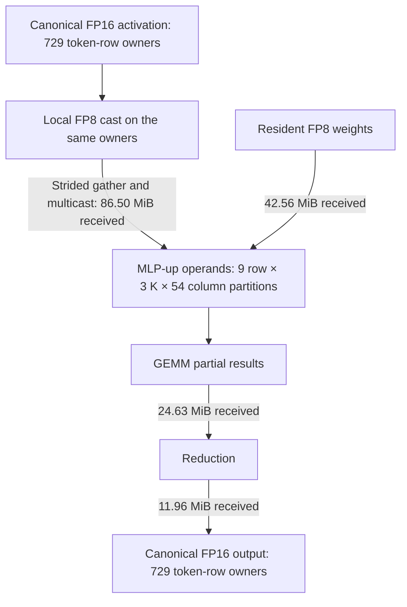

# FP8 exchange fragmentation and forwarding — 12 September 2026

The production bug was an incomplete FP8 panel conversion, not a limitation of
the scheduler's coalescer. Commit `4ac5210` made complete-grid traversal use the
format's 32×16 / 16×32 FP8 panels. The irregular fallback and row-tail extension
still used `AMP_COLUMN_MICRO` (16) on both axes. Existing randomized clipped-panel
tests only exercised FP16; the FP8 test only exercised complete grids.

## Code path

1. Baseline planning chooses compact parameter homes independently of compute
   replication (`mid/baseline.rs`). Operator input conversion supplies the packed
   format; the GEMM implementation materializes its row/column/inner dispatch
   grid (`mid/implementation/gemm.rs`).
2. `mid/copy.rs::compose` previously stopped at **every** increase in replicas.
   Consequently a format conversion and a following replication remained two
   copies even if both could be implemented entirely as exchange byte movement.
3. `low/expand/materialize.rs` intersects source and destination views.
   `conversion.rs::prepare_mapped_views` recognizes compatible micro-panel
   layouts, prepares local copies and collects matching sources into multicast
   requests. Its panel decision used to cover the entire materialization batch.
   One clipped mapping forced every other destination through the fallback.
4. `mapping.rs::split_mapping_at_panel_boundaries` cut those views into 16×16
   pieces. In FP8 a half-panel consists of alternating 16-byte spans; the second
   half visits the gaps afterward. This discarded contiguity before physical
   exchange generation. The tail-padding helper could also stop at a half-panel.
5. `exchange.rs::prepare_transfer` zipped those physical spans into SEND/RECEIVE
   specs. `coalesce_pending_transfers` only joins adjacent contiguous spans; it
   cannot recover the interleaved halves from separately expanded views.
6. Low exchange grouping merges adjacent exchange phases while retaining transfer
   order. This puts the initial weight distribution and its forwarding multicast
   in one phase. `memory_dependencies` derives receive/forward ordering from the
   ordered address accesses. Sorting the entire phase would corrupt that meaning.

## Fix

- Split clipped mappings and extend tails using each format's actual panel shape.
- Select complete-grid versus clipped traversal per destination. A tail on one
  destination no longer expands the grids on all other destinations.
- Compose into replication when the preceding copy is an identity-layout or
  native-panel mapping without a factor view. Retain pack-once staging when the
  preceding conversion needs local packing. Precision conversion restrictions,
  single-use requirements and compute/Repeat barriers remain enforced.

No scheduler reorder pass, address-specific exception or extra planning layer was
added. The existing low expansion feeds both geometry costing and physical codegen.
The initial experiment proving relative traversal equivalence was discarded once
the stale panel fallback was found; it did not address the actual failing path.

## Measurements

Batch-two, 27-layer SigLIP capacity-baseline captures; ordinary B1024 replay,
provisional placement. These are modelled exchange cycles, not hardware timing.

| Weight phase | Transfers before → panel fix | Max row bytes before → panel fix | Exchange cycles before → panel fix |
|---|---:|---:|---:|
| MLP down, phase 55 | 303,042 → 4,326 | 7,936 → 1,324 | 14,672 → 14,171 |
| MAP down, phase 124 | 301,599 → 2,790 | — → 236 | — → 1,112 |

Phases 16, 50, 54, 56 and 70 retained their transfer counts and replay results:
their large exchanges have different geometry. The initial panel-fix capture's
maximum fragment estimate fell from 16,968 to 15,254 and detailed row estimate
from 161,504 to 141,216 bytes. Later tail and composition changes reduced the
fragment estimate to 15,017, with a 142,912-byte row estimate. These estimates
are not the final shared package table size.

A controlled direct-multicast experiment on the *same* old layout gives 9,611
exchange cycles and 1,332 max row bytes, versus 14,171 / 1,324 with repaired
forwarding. Eighteen source tiles need local delivery; their payloads are at most
3,072 bytes/tile. Some cannot receive their own multicast at the existing SRAM
element addresses, so the experiment removes self-receivers and records the
required copies separately. It is not an executable model and excludes copy cost.

Normal planning with composition enabled selects a different down-GEMM layout
(row block 384 rather than 192): its weight phase has 2,160 transfers and a
236-byte max row, but 22,673 exchange cycles. The changed layout has a different
replication/bandwidth tradeoff; do not present this as the same-layout speedup.
The corresponding MAP down exchange has 1,725 transfers and a 56-byte max row.

## Validation and artifacts

The final full codegen suite passes with 242 enabled tests and four ignored tests.
The expanded randomized padding test includes FP8. A new regression checks byte
pairings for clipped FP8 panels and ensures an irregular destination leaves a
regular destination as one compact logical exchange. A further composition test
checks native FP8 replication; the five composition tests pass.

The final one-layer batch-two capacity baseline passes on hardware, including
FP32 reference comparison (minimum cosine **0.997085087**, maximum absolute
error 0.157806). This diagnostic used a 128 KiB exchange-table budget because
the default 80 KiB rejects its 99,228-byte maximum encoded table. This validates
the changed lowering; it does **not** demonstrate that the 27-layer model fits.
The hardware log is `artifacts/exchange-packing-20260912/hardware-run.log`.

Captures, selected replay fixtures and logs are under
`artifacts/exchange-packing-20260912/`: `siglip-panels-fixed.json`,
`siglip-direct-fixed.json`, `fixed-phase-*`, `direct-phase-*`, and the
`siglip-worst/phase-55-direct-*` controlled experiment. Earlier geometry-only
and invalid whole-phase reordering experiments remain for reference.

## Reanalysis of the activation pathway

The **80 KiB budget is for compact encoded exchange tables per tile**, across
phases after row sharing. It is a compiler policy, not a hardware limit, payload
size, or allocation for activation tensors. Repeat bodies need their rows stored
once. The separate transfer-fragment limit bounds scheduling complexity. Neither
limit justifies calling the chosen exchanges efficient.

The initial phase labels described only the first transfer in a fused phase.
Capture now records every movement class, including tensor formats, shard/view
geometry, receiver payload and source/receiver tiles. `siglip-traffic.json`
contains this metadata; `traffic-details.json` is its extracted `phase_traffic`
map. Source payload is counted once per class and must not be summed as physical
wire traffic when one multicast spans different destination classes. Receiver
payload is additive, includes padding and counts each multicast recipient.

The following numbers describe the final 27-layer **batch-two capacity baseline
capture**, with optimization disabled. Each row counts one occurrence of the
phase, not all Repeat iterations. They are payload measurements, not timings.

| Movement | Phase | Receiver payload | Activation replication |
|---|---:|---:|---:|
| QKV activation input | 16 | 57.67 MiB | 36 |
| QKV weights | 16 | 37.97 MiB | — |
| QKV output to canonical ownership | 18 | 9.60 MiB | 1 |
| MLP-up activation input | 50 | 86.50 MiB | 54 |
| MLP-up weights | 50 | 42.56 MiB | — |
| MLP-up reduction contributions | 51 | 24.63 MiB | — |
| MLP-up output to canonical ownership | 52 | 11.96 MiB | 1 |
| MLP-down activation input | 54 | 35.91 MiB | 6 |
| MLP-down weights | 55 | 94.92 MiB | — |
| MLP-down reduction contributions | 56 | 37.96 MiB | — |
| MLP-down output to canonical ownership | 57 | 3.20 MiB | 1 |

### Why the activation transfers are small

`mid/baseline.rs::canonical` uses all available **token-row** owners for the
capacity baseline. For `[2,729,1152]`, that means 729 tiles with shards
`[2,1,1152]`: the batch axis stays together. This distributes residual storage
well and keeps full rows local for normalization, but it is not an efficient
packed GEMM boundary by construction.

`mid/lowering.rs::ensure_format` supports early and late FP8 casts. The selected
early path casts on these 729 owners. For MLP-up it then gathers into a GEMM grid
of 9 row partitions × 3 K partitions × 54 column partitions. A destination holds
`[2,80 or 82,384]`, replicated over the 54 column partitions. A source contributes
`[2,1,384]`. In AmpLeft storage, the two source batch rows are adjacent within a
32-column microblock, but the corresponding destination rows are separated by
the other token rows. Each of the 12 column microblocks therefore needs separate
batch-row fragments. The geometry gives about **52,488 activation sends**
(729 × 3 × 12 × 2), each serving a multicast group.

The physical capture confirms this exactly. In these input phases, parameter
senders have 27 Repeat source addresses and activation senders have one, allowing
the physical streams to be counted separately:

| Phase | Activation sends | Payload per send | Receiver payload |
|---|---:|---|---:|
| QKV input, 16 | 52,488 | All 32 B | 57.67 MiB |
| MLP-up input, 50 | 52,488 | All 32 B | 86.50 MiB |
| MLP-down input, 54 | 196,830 | 195,372 × 32 B; 1,458 × 16 B | 35.91 MiB |
| MLP-down reduction, 56 | 17,040 | 12,780 × 2,304 B; 4,260 × 2,432 B | 37.96 MiB |
| MLP-down canonical output, 57 | 104,892 | All 32 B | 3.20 MiB |

Thus the current down reduction has large transfers but substantial total
payload; its input and canonical output have extreme fragmentation. The earlier
586,368-transfer down reduction belonged to the previous GEMM grid and must not
be attributed to this final capture.

Those fragments implement real destination strides. This is different from the
fixed weight bug, where halves of contiguous native panels were unnecessarily
split. Sorting cannot remove the activation fragments while preserving the
chosen layouts. Multicast already avoids sending the source payload 54 times;
86.50 MiB is receiver traffic, not 86.50 MiB of distinct source transmissions.

The reduction and output-conversion rows above are separate costs. Parallel-K
GEMMs create partial results; `low/expand/reduce.rs` gathers contributor slices
into reduction buffers. The baseline then converts the reduced packed output
back to canonical row ownership. Copies cannot compose through an actual
reduction or cast. Restoring canonical boundaries simplifies planning, but the
resulting conversion traffic is not an unavoidable cost of the mathematical
operation.

### What selection currently misses

1. **Capacity ranking does not minimize combined storage.** The baseline's
   primary score is `MemoryPeaks.total`, which excludes exchange rows. Largest
   standard allocation is next; exchange rows are only the third tie-breaker.
   Thus a tiny tensor-memory saving can beat a large estimated table increase.
   The existing `total_with_exchange()` helper includes both, and other Pareto
   objectives already use it. The row estimate sums phase maxima and is coarse,
   however: changing this score needs measurement, not a claim that it proves
   placement feasibility.
2. **Cast order is not a general staging-layout search.** The early variant
   keeps producer ownership and the late variant redistributes toward consumer
   ownership before casting. Neither enumerates an independent, unreplicated
   gather/pack layout, followed by multicast of complete consumer panels.
   `mid/packing.rs` explores distributing FP16 BlockMajor packing onto more
   owners; it does not supply this FP8 AmpLeft alternative.
3. **Canonical ownership and the GEMM grid trade against each other.** More
   column partitions reduce per-tile weight storage but increase activation
   fanout. More row partitions do the reverse; more K partitions create more
   reduction work. A candidate must be evaluated with input redistribution,
   local packing, compute, reduction, output conversion and their live storage.
   Optimizing just one transfer count can shift rather than remove the cost.

The next useful controlled comparison is direct strided multicast versus
gather-once/pack/multicast, alongside alternate GEMM grids using the same
complete-boundary accounting. Staging adds scratch, a local pass and potentially
a barrier, so it is not automatically superior. This report does not claim the
remaining activation exchanges are optimal, nor that increasing the table
budget is their fix.
