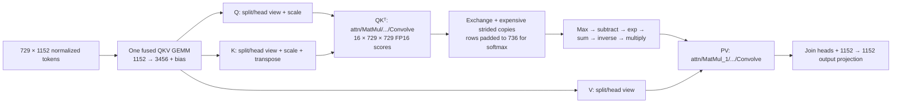

# SDK ONNX profile analysis (2026-09-07)

Sources: `../poprt/profile_logs/inference/profile.pop`,
`../poprt/profile_logs_f8weight/inference/profile.pop`, and the optimized ONNX
models in `../poprt/dir` and `../poprt/dirf8weight`. This is analysis of the
existing recordings, not a new hardware benchmark or an accuracy validation.

## What model and execution are present?

The input is FP16 `[1,3,384,384]`, with 729 patch tokens, model width 1152,
16 heads of width 72, **27 transformer blocks**, and attention pooling to an
FP16 `[1,1152]` result. The extra attention/softmax in the graph belongs to
pooling; there are not 28 transformer blocks.

The compiler outlines shared bodies into `call_subgraph(0)` and
`call_subgraph(1)`. Names such as `blocks.0` survive on shared code and do not
identify the current model layer. The same main QKV, QK, PV, output projection,
and MLP compute sets each execute 27 times per inference (54 times across the
two recorded inference runs). This is code reuse through calls; the profile's
explicit `Repeat` has count 1. There are only 314 / 261 compute sets in the two
compilations, respectively.



Full FP8 adds casts on QKV inputs and the Q/K/V/probability operands. The
weights-only variant casts stored FP8 parameters back to FP16 before GEMMs.
There is no FlashAttention-style fusion: scores and probabilities are explicitly
materialized.

## The short Convolve really is QK transpose

First shared-body invocation; numbers are the measured longest-tile compute-set
cycles, excluding its exchange, local preparation, and following sync. They are
not complete operator latency or additive wall-time measurements.

| Kernel | Full FP8 recording | FP8-weight recording |
|---|---:|---:|
| Fused QKV projection | 22,415 | 37,277 |
| QK transpose | 5,502 | 8,488 |
| PV | 7,377 | 12,900 |
| Attention output projection | 8,178 | 14,153 |
| MLP up | 26,425 | 48,248 |
| MLP down | 28,265 | 52,187 |

QK is step **140**, compute set **38**, in the full-FP8 recording:
`/visual/trunk/blocks/blocks.0/attn/MatMul/1811/matmulGrouped/Conv_1/Convolve`.
It is step **121**, compute set **28**, in the weights-only recording, with
`1583` in place of `1811`. Both execute on all **1,472 tiles**. These are absolute
step IDs in the first recorded inference, after the initial setup run.

The real QK work is `2 × 16 × 729 × 729 × 72 = 1,224,440,064` FLOPs.
The target reports 16 convolution units per tile and 4 / 8 input elements per
cycle for FP16 / FP8. Counting a multiply-add as two FLOPs gives ideal whole-device
bounds of 6,499 / 3,249 cycles, respectively. Thus 8,488 FP16 cycles is plausible:
about 77% of peak on useful, unpadded work. QK is only about 21% of the fused QKV
projection's arithmetic, and is substantially easier to distribute densely than
its short inner dimension might suggest.

The output allocations are exactly 736 shards of 11,648 bytes and 736 of
11,680 bytes. Combined with 16-column convolution blocks, this is consistent
with a **2 × 46 tile grid per head**: 364/365 query rows by 16 key columns, with
keys padded to 736. This geometry is inferred from allocations, not an exported
Poplin plan. Tile-0 operands also match inner padding to 80 for FP16 and 96 for
FP8: FP16 receives a 58,240-byte activation slab (`364 × 80 × 2`), whereas FP8
receives 34,944 bytes (`364 × 96`). Local plus incoming coefficient storage is
2,560 / 1,536 bytes, respectively. QK has no subsequent `Reduce0`; its next work
is rearranging its output into softmax rows.

## The large costs are mostly elsewhere

Both recordings have the same score-to-softmax preparation:

- Exchange: 4,477 maximum-tile cycles.
- Main local copy set: **126,283 cycles on 1,458 tiles**, followed by a
  2,936-cycle copy set. Its vertices include 13,587 `DstLongStridedCopy` and
  6,033 `StridedCopyAT2` instances, rather than one specialized transpose kernel.
- Softmax then occupies seven compute sets. Their individual maximum durations
  sum to about 18,300 cycles; this sum is not a barrier-adjusted wall span.
- Softmax output allocation is 11,776 bytes on each of 1,458 tiles, consistent
  with eight complete rows padded to 736 columns per tile.

Full FP8 additionally casts the probability matrix before PV. Its post-cast
rearrangement alone has a 52,333-cycle maximum. PV preparation includes further
27,832-, 24,722- and 13,165-cycle copy sets, plus a 56,986-cycle pre-arrangement
before the 7,377-cycle GEMM. Some preparation can run on different tile subsets;
these maxima must not simply be added with the large sync waits.

The weights-only graph combines Q/K preparation in one copy/exchange operation
whose destinations include both GEMM operand layouts. V is prepared later,
including a transpose. So the source graph has separate Q/K/V views, but it is
not uniformly three independent full-copy preparation phases.

## Precision and numerical confidence

The full-FP8 projection, QK and PV vertices are
`ConvPartial1x1Out<quarter,half,true,false,16,8,false>`: FP8 operands and FP16
partial outputs. All 168 graph matmuls use the custom FP8 operator.

The weights-only graph has 112 FP8-weight matmuls and 56 ordinary FP16 matmuls.
`b_cast` uses `Cast2D<quarter,half>` / `Cast1DSingleWorker<quarter,half>`;
convolutions then use `ConvPartial1x1Out<half,half,true,false,16,4,false>`.
QK and PV are directly ordinary FP16 matmuls. Its compute timings are therefore
useful FP16 reference points, though weight residency, precision, and the rest
of the implementation differ from our stack.

Both optimized models specify F143 with scale **-1** for the first block's FP8
parameters; full FP8 uses that same scale for its probability conversion. A
host check with the installed PopRT conversion helper maps uniform probability
`1/729 = 0.0013717421` to `0.00146484375`, giving row sum **1.06787109375** after
quantization; a probability of 0.0001 maps to zero. This illustrates a concrete
quantization concern, not proof that the model's real outputs are wrong. There
are no saved reference/output comparisons in these profiles, so correctness
remains unverified. The graph does contain the expected scaled QK, softmax, and PV.

## Whole-model time and exchange storage

For the second recorded inference, the device span from the first exchange after
input delivery through the final compute completion before output streaming is:

| Recording | Device cycles | At recorded 1.85 GHz | Recorded run duration |
|---|---:|---:|---:|
| Full FP8 | 17,804,824 | 9.624 ms | 12.829 ms |
| FP8 weights / FP16 compute | 15,987,659 | 8.642 ms | 11.923 ms |

The first recorded inference gives 17,886,945 / 15,987,664 device cycles. These
are existing samples, not reruns. Raw `execution_cycle_totals` includes long host
waits and is unsuitable for model-only timing. This crop is defined from SDK
steps; it is not an assertion of identical profiling boundaries to our renderer.

Regular GEMM exchange rows really are small: QK's input exchange is at most
248 bytes per tile, and QKV's is 164 / 324 bytes. However, score-to-softmax
rearrangement requires up to **7,372 bytes**, averaging 5,242 bytes across tiles.
PV's main exchange reaches 492 / 2,212 bytes. Small GEMM rows do not describe all
of its communication.

Actual resident `internalExchangeCode` for the entire model:

| Recording | Average per tile | Maximum per tile |
|---|---:|---:|
| Full FP8 | 15,529 bytes | 36,696 bytes |
| FP8 weights | 15,603 bytes | 37,092 bytes |

Reuse of outlined bodies is important to these totals. Whole-tile allocated
memory averages 487,748 / 550,544 bytes, with maxima 540,950 / 596,494 bytes.

The useful lessons are fused QKV, broad output-stationary score grids and reusable exchange code. Our current
attention score kernel already uses inner padding to 80, matching this SDK
FP16 case; reducing that padding is not an explanation for the observed gap. The SDK's generic
strided-copy preparation is an example to improve upon, not a uniformly better
layout pipeline. Faster scheduling would help compilation but would not remove
those device-side rearrangement costs.

## Reproducing the extraction

Enable the installed Poplar SDK, then run its Python 3.8 environment:

```sh
python scripts/sdk-profile-summary.py \
  ../poprt/profile_logs/inference/profile.pop \
  ../poprt/profile_logs_f8weight/inference/profile.pop
```

The script requires the SDK's `pva`. It opens SQLite read-only and writes
`summary.json`, an annotated full `steps.csv`, and `first-body.csv` under
`artifacts/sdk-profile-analysis/<profile-directory>/`. The CSV adds semantic
stage labels, kernel names, active tile counts, and maximum exchange code bytes.

## Comparison with our current materialized path

The `attention-panel-pack` profile identifies our score kernel as
`ipu_stack_gemm_f16_init_large_rows_k80_c768_r7_r8`, taking 54,744 cycles
(54,312 for the seven-row variant). Our attention candidate generator maximizes
query-row partitions, then the implementation copies that ownership into scores,
softmax weights, PV products and final output. For 16 heads this gives 92 tiles
per head, partitioned only along query rows. It does not enumerate the SDK-like
2D score grid.

This geometry makes each tile compute roughly 8 × 768 scores instead of
364/365 × 16. Both have similar output element counts, but our supervisor cycles
through 48 column groups and five inner groups: 240 coefficient-load/worker-sync
rounds, versus five for a 16-column, K80 product. Each worker receives only one or
two query rows per round. The existing standard-memory kernel cost formula
predicts approximately 8,899–8,919 cycles for 364/365 rows, K80, C16, although that
specific specialization has not been hardware-tested here. The kernel generator
already accepts those dimensions; no SDK-only instruction appears necessary.

The actual restriction is the attention plan family, not general tensor-layout
expressiveness. A separate score layout would need a mid redistribution into
complete softmax rows, or distributed softmax with cross-tile reductions. The
SDK chooses redistribution and pays heavily for it. Our row ownership avoids
that intermediate redistribution but sacrifices GEMM coefficient reuse. A new
candidate should cost the entire preparation/QK/softmax/PV sequence rather than
assuming that the fastest isolated QK necessarily wins overall.

## FP8 cast comparison after packed-cast optimization

In the full-FP8 recording, the first shared body's casts have the following
maximum tile durations. Output sizes come from `vars_info` joined to
`vars_string_table`, selecting each cast's `cast#` allocations (excluding
exchange-message allocations). FP8 uses one byte per value.

| Cast | Step | Active tiles | Maximum output bytes/tile | Cast cycles |
| --- | ---: | ---: | ---: | ---: |
| QKV activation | 95 | 1440 | 592 | 548 |
| Q, K, V, each | 121, 127, 116 | 491–492 | 1712 | 824 |
| Probabilities before PV | 155 | 1458 | 5832 | 3343 |
| MLP up activation | 240 | 1440 | 592 | 548 |
| MLP down activation | 273 | 1464 | 2144 | 932 |

The 1D cases use `popops::Cast1D<half,quarter>`; probabilities use
`Cast2D<half,quarter>`. The profile labels these vertices C++, which does not
identify their generated instruction sequence. These durations exclude exchange,
rearrangement, and sync and must not be interpreted as complete conversion cost.

The SDK QKV input cast writes exactly 839,808 bytes across all tiles: one copy
of the logical 729x1152 activation. Our packed QKV cast writes 13,565,952 bytes
(9,216 per tile) and takes 4,914 cycles. Its much greater total work comes from
casting the replicated GEMM operand. SDK casts before replication/exchange.
Likewise SDK's MLP-up cast writes one logical copy, whereas our external input
has already been replicated into the selected consumer ownership. Quantization
before fan-out is therefore a useful candidate even with the improved kernel;
for externally populated inputs it would add a device exchange that our current
host-populated layout avoids. For intermediate tensors it can also reduce
exchange payload width. This comparison does not establish which complete plan
wins without modelling the changed exchange and packing.

The SDK's layout handling is not uniformly cheaper: the probability cast has
1,772-cycle pre-arrangement and 52,333- and 547-cycle post-arrangement compute
sets. MLP-down cast is followed by an 887-cycle exchange and a 3,123-cycle local
copy set before its GEMM input exchange. These are separate maximum-tile
measurements, not additive barrier-adjusted spans.
