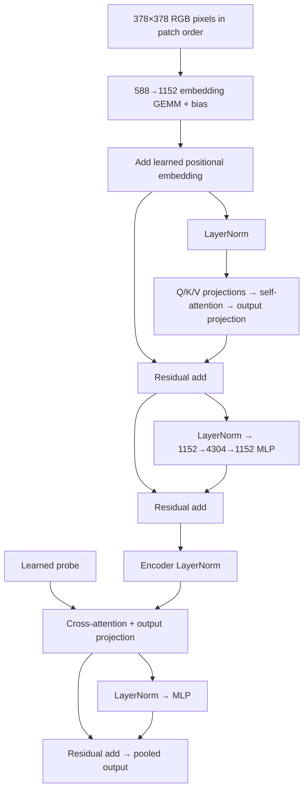

# Single-layer SigLIP vision benchmark

`--workload siglip-vit-benchmark` builds the image encoder from
`../big_vision/big_vision/models/vit.py`, using So400m/14 dimensions with encoder
depth reduced from 27 to one. Input is 378×378 RGB, the usable region of the
384-pixel model's VALID patch convolution. This gives 729 tokens of width 1152,
16 attention heads of width 72, and MLP hidden width 4304.

The graph includes patch projection and bias, learned positional embedding,
pre-normalized self-attention with Q/K/V and output projections, the attention
residual, pre-normalized MLP with biases and its residual, and final encoder
layernorm. MAP pooling uses a shared learned probe, its own Q/K/V and output
projections, and a layernorm/MLP residual. The returned tensor is `[batch, 1,
1152]`, retaining the singleton probe axis. Dropout is omitted. There is no
optional classifier, representation projection, text tower, or contrastive
embedding normalization.



The image binding contains all pixels in `[batch, patch_y, patch_x, y, x,
channel]` order, flattened to `[batch, 729, 588]`. Host patch packing is outside
the timed device program; the convolution itself is the timed embedding GEMM.
Weights use deterministic Gaussian Xavier-style initialization, positional
embeddings use standard deviation `1/sqrt(width)`, layernorm scales are one,
and biases are tiny Gaussian values. Each batch uses the same learned probe.
These are performance/implementation tests, not pretrained accuracy evaluations.

Layernorm is a reusable graph operation with epsilon 1e-6 and affine parameters.
Its initial F16 codelet uses F32 centered statistics and owns complete rows per
worker. The current kernel requires even-width unpadded rows. Floating-point
addition supports equal shapes and contiguous suffix broadcasting, covering
residuals, bias vectors and positional embeddings. Neither operation silently
interprets unsupported storage as a compatible layout.

Example (native FP8 weights, F16 normalization and residuals):

```sh
RAYON_NUM_THREADS=24 target/release/ipu-trivial-test c600-init.ipucfg \
  --workload siglip-vit-benchmark --fp8-scale=-4 \
  --device-lock artifacts/layout-sweep/device.lock \
  --package artifacts/vit/so400m-fp8/model.ipuexe \
  --profile-output artifacts/vit/so400m-fp8/profile.ipuprof
```

Omit `--fp8-scale` for F16 GEMMs. Unlike the older isolated benchmarks, this
benchmark retains non-weight inputs in F16 when selecting FP8 GEMMs; the planner
inserts activation casts where required. All final outputs are checked against
the host reference automatically. `--vit-small --tiles 64` uses a 28×28 image,
width 128, two heads and MLP width 256 while preserving the whole graph.
`--vit-batch` sets the batch size (default one).
