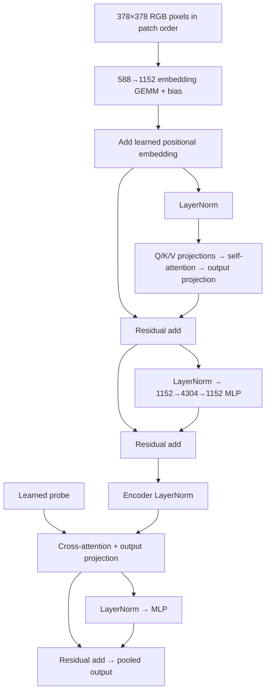

# Single-layer SigLIP vision benchmark

`--workload siglip-vit-benchmark` builds the image encoder from
`../big_vision/big_vision/models/vit.py`, using So400m/14 dimensions with encoder
depth reduced from 27 to one. Input is 378×378 RGB, the usable region of the
384-pixel model's VALID patch convolution. This gives 729 tokens of width 1152,
16 attention heads of width 72, and MLP hidden width 4304.

The graph includes patch projection and bias, learned positional embedding,
pre-normalized self-attention with Q/K/V and output projections, the attention
residual, pre-normalized MLP with biases and its residual, and final encoder
layernorm. MAP pooling uses a shared learned probe, its own Q/K/V and output
projections, and a layernorm/MLP residual. The returned tensor is `[batch, 1,
1152]`, retaining the singleton probe axis. Dropout is omitted. There is no
optional classifier, representation projection, text tower, or contrastive
embedding normalization.



The image binding contains all pixels in `[batch, patch_y, patch_x, y, x,
channel]` order, flattened to `[batch, 729, 588]`. Host patch packing is outside
the timed device program; the convolution itself is the timed embedding GEMM.
Weights use deterministic Gaussian Xavier-style initialization, positional
embeddings use standard deviation `1/sqrt(width)`, layernorm scales are one,
and biases are tiny Gaussian values. Each batch uses the same learned probe.
These are performance/implementation tests, not pretrained accuracy evaluations.

The default tensor precision is F16, including attention results, residuals,
bias additions and GELU. F32 is retained for layernorm statistics and internal
attention softmax/accumulation state; attention explicitly converts its result
back to F16. Selecting FP8 GEMMs does not change this policy.

Layernorm is a reusable graph operation with epsilon 1e-6 and affine parameters.
Its F16 codelet shares each row across all six workers, using separate local
sum, centered-variance and affine passes. Statistics stay F32, with 96 bytes of
shared scratch and local synchronization between passes. The kernel requires
even-width unpadded rows. Floating-point
addition supports equal shapes and contiguous suffix broadcasting, covering
residuals, bias vectors and positional embeddings. Add offers column sharding
and preserves compatible input layouts, including packed equal-shape residuals,
rather than always gathering complete rows. Neither operation silently
interprets unsupported storage as a compatible layout.

Example (native FP8 weights, F16 normalization and residuals):

```sh
RAYON_NUM_THREADS=24 target/release/ipu-trivial-test c600-init.ipucfg \
  --workload siglip-vit-benchmark --fp8-scale=-4 \
  --diagnostic-atol 0.2 --diagnostic-rtol 0.05 \
  --device-lock artifacts/layout-sweep/device.lock \
  --package artifacts/vit/so400m-fp8/model.ipuexe \
  --profile-output artifacts/vit/so400m-fp8/profile.ipuprof
```

Omit `--fp8-scale` and the tolerance flags for F16 GEMMs. Unlike the older isolated benchmarks, this
benchmark retains non-weight inputs in F16 when selecting FP8 GEMMs; the planner
inserts activation casts where required. All final outputs are checked against
the host reference automatically. `--vit-small --tiles 64` uses a 28×28 image,
width 144, two 72-wide heads and MLP width 288 while preserving the whole graph.
`--vit-batch` sets the batch size (default one).

The FP8 example explicitly loosens the comparison tolerance. Small upstream
rounding differences can cross activation-quantization thresholds and accumulate
through the 13 GEMMs; the host reference quantizes operands at each selected
GEMM but does not reproduce the hardware's intermediate rounding exactly.
The small complete graph has maximum absolute error 0.00293 with F16 GEMMs and
0.12988 with FP8 GEMMs. This comparison does not establish pretrained accuracy.

The initial full-size F16 search was rejected by memory accounting: its
shortlisted plans reach 540,544 tensor bytes plus 49,152 support bytes per tile
at the encoder down-projection, or exhaust SRAM later at MAP preparation.
This is a planner/layout limitation, not a requirement for FP32 arithmetic.
The reduced F16 model passes on hardware.

Initial full-size hardware validation (2026-09-07): native FP8 GEMMs, F16 exposed
activations, 2,656,824 cropped profile cycles (1.771216 ms at 1.5 GHz).
Maximum absolute reference error is 0.102051, using the explicit tolerance in
the command above. The rendered profile is
`artifacts/vit/so400m-fp8/profile.html`; raw samples and the run log are adjacent.
The measurement includes embedding, one complete encoder block, final norm,
and MAP pooling; host patch packing and parameter loading are outside it.

Validation exposed and fixed three memory hazards: short AMP-left packing
workers wrote beyond their row allocation; tensors could share instruction
memory elements with linked kernels; final attention padding could contain
FP32 values that faulted during the F16 cast. Final merge now clears just that
padding. Mixed-class multicast loopbacks and late exchange-row setup calls
also now receive the required placement and code-size reservations.

## Performance follow-up

The initial profile exposed scalar Add indexing, scalar single-worker layernorm,
and four separate instructions per 32-bit AMP-left packing word. Add now has
native half2 dense paths and column/layout-preserving planning choices. LN shares
a row across six workers and retains centered F32 statistics. Aligned AMP-left
packing uses 64-bit loads/stores with built-in address updates. LN now has an
arithmetic-work estimate in profile metadata instead of reporting N/A.

Broadcast operands are partitioned along the output's matching dimensions,
replicating only dimensions being broadcast. Equal-shaped packed operands retain
their physical padding. Batch validation also exposed missing matrix iteration
in row-major packing. Packing now follows the storage representation: AMP-left
panels flatten batch and row, while coefficient formats retain separate matrices.
Both F16 and FP8 two-image small models pass all 40 operator checkpoints; final
maximum absolute errors are 0.004395 and 0.130188, respectively.

The larger plans exposed excessive lazy heap refreshes in exchange scheduling.
Initially ready transfers with identical endpoint roles share one global heap
entry; later dependency releases remain individual entries. Multicast pressure
is now refreshed even when readiness has not changed, avoiding history-dependent
stale-pressure choices. Stale keys update in place, with a linear refresh/rebuild
when individual heap repairs would cost more. Randomized comparison with eager
priority selection covers unicast, multicast and memory hazards.

With the same 64-tile planning budget, the small FP8 model decreased from
255,804 to 137,268 cropped cycles. Its rendered profile is
`artifacts/vit/optimized-small-fp8/profile.html`. This is a kernel/planning
regression check, not a substitute for the full-size measurement: the full
model selects substantially different shard sizes and exchange patterns.
The release tests pass (158 codegen tests, six benchmark/CLI tests and the
graph doctest), as does Clippy with the repository's existing complexity
allowances.

A separate four-token diagnostic retains the full 1,152/4,304 channel widths
and 16 heads. It passes FP8 hardware/reference validation (maximum absolute
error 0.145020). Its 1,152-wide LN takes 15,558 cycles per row, versus 138,678
in the original full-size profile. Its final Add uses 288 tiles and spans 456
compute cycles (378 per tile), versus the original single tile's 26,850 cycles.
The complete diagnostic is 224,718 cropped cycles; this is **not** the
729-token model's runtime. Its profile and the diagnostic binary's exact shape
override are under `artifacts/vit/full-width-four-token-diagnostic/`.

The subsequent full-size build did not reach hardware: exact scheduling took
7,290 seconds, then package assembly failed to find a contiguous executable
range for a 142,056-byte compact exchange-table reservation. Phase 33 contained
784,404 transfers and dominated the compiler tail. Its selected schedule's
1,176,310-cycle estimate is not a measured speedup. The failure log remains at
`artifacts/vit/optimized-so400m-fp8/run.log`.

Receive controls now remain stably sorted as they are inserted, and conflict
checks use timestamp lookups. A mixed ordinary/paired sequence with 4,096
incremental validations decreased from 847 ms to 358 ms with unchanged encoded
word counts and checksums (`benchmark_receive_validation`, an ignored CPU
benchmark in ipu-exchange). This does not eliminate quadratic copying of encoded
prefixes. Slow instruction-alignment retries now log their start and duration.
Package construction now participates in finalist acceptance: failure to place
the linked image, row tables or tensors rejects that candidate without consuming
the successful-finalist budget. The next shortlisted candidate is then tried.
Incremental alignment retries were initially limited to 64 Mi accumulated endpoint-history
entries per schedule attempt. This deterministic compilation-effort policy
leaves ordinary deferred scheduling unrestricted and reports budget exhaustion
separately from invalid exchange instructions. It does not claim the rejected
layout is physically impossible.

The two-image small FP8 model passes hardware/reference validation with this
acceptance path (maximum absolute error 0.130188), under
`artifacts/vit/bounded-small-b2-fp8/`. Regression tests cover package rejection
followed by successful selection and budget exhaustion with a still-valid
exchange schedule. The full-size rerun is recorded under
`artifacts/vit/bounded-so400m-fp8/`.

The four-column Add candidate was another source of fragmentation: 729 rows
times 4,304/4 column strips gives 784,404 transfers. Its replacement fills a
row/column grid using rows first, then the remaining column parallelism. The
1,472-tile candidate uses 729 row partitions and two column partitions for that
matrix; a single 1,152-wide row still uses 288 column owners. Existing input
layouts can still be preserved.

With this change, the largest logged phase in the full-size rerun has 195,844
transfers. Scheduling rejects all eight finalists within the effort limit in
335 seconds; it still does not produce a full-size package. Logs are under
`artifacts/vit/row-grid-so400m-fp8/`. The two-image small FP8 model passes on
hardware with the row-first grid (maximum absolute error 0.130188); its rendered
profile is `artifacts/vit/row-grid-small-b2-fp8/profile.html`. The grid tests cover
single-row, short-matrix and 729-by-4,304 broadcast additions, and all 160 codegen
tests and Clippy pass. A better full-model shortlist remains necessary.

The next search preserves resource diversity through the final cutoff. Each
configuration keeps its fastest estimated plan, its smallest estimated exchange
tables, and its lowest total-memory plan before filling remaining slots by
latency. The beam also protects a minimum-row-storage representative before
format-family selection. Previously the final latency-only cutoff could discard
the resource alternatives that survived Pareto pruning. This uses the existing
row-storage estimate, not a raw transfer-count limit.

The incremental validation budget is now 512 Mi endpoint-history entries per
schedule attempt (eight times the initial limit). The shortlist regression,
all 161 codegen tests and 46 exchange tests pass. Clippy passes too. The full-size rerun is under
`artifacts/vit/diverse-so400m-fp8/` and now builds and passes hardware/reference
validation, with maximum absolute error 0.096191. Its cropped runtime is
**1,010,676 cycles (0.673784 ms)** versus the original full-size benchmark's
2,656,824 cycles (1.771216 ms): a 62% reduction, or 2.63x speedup. This comparison
includes the accumulated kernel and layout changes described above, not just
the budget/shortlist change.

The first latency-ranked candidate succeeds, so the increased effort budget
is decisive in this run; the resource alternatives are retained but not needed.
The final selection stage, including scheduling and package construction,
takes 179 seconds. The complete invocation takes about five minutes. Incremental
checks for 195,656-transfer and 127,500-transfer phases finish in about 13 and
15 seconds respectively. Package support reserves 38,516 bytes per tile for
exchange tables. The profile is rendered as `profile.html` in the run directory.
The remaining 729-by-16 coefficient-packing kernel reaches 77,790 cycles on only
80 tiles and accounts for 160,992 cycles of combined phase spans across its two
occurrences; broad shortlist retention alone does not fix that implementation.

Remaining structural limitations include standalone projection bias additions
(which require row-major traversal), separate Q/K/V GEMMs in this benchmark, and
large coefficient-layout packing operations with sparse ownership. The single-row
MAP normalization still resides on one tile, using all six workers; cross-tile
statistics would require a different normalization implementation.

The block-major coefficient packer now accepts full-height row blocks that are
multiples of 16, instead of only 64-row blocks. The 729-to-768-row attention
packing uses the existing wide-load/sort assembly rather than scalar C++.
`artifacts/vit/wide-pack-so400m-fp8/profile.html` records the full model at
971,724 cropped cycles (0.647816 ms), with unchanged maximum reference error
0.096191. Its two large coefficient-packing occurrences each fall from 77,790
to 58,314 cycles. Kernel-build setup for rearrangements was consolidated at the
same time, removing repeated flag and compilation assembly.
